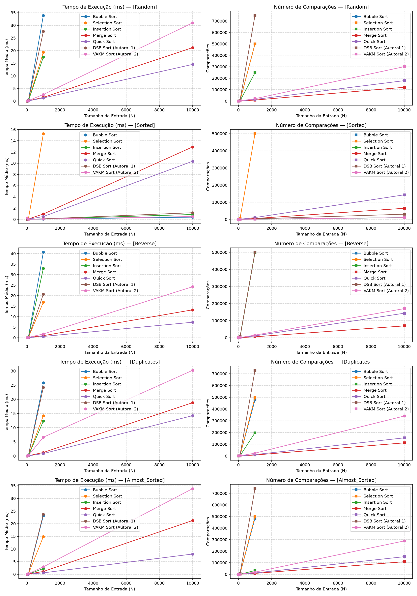

# Relatório Técnico: Trabalho Prático 1 (TP1) — Métodos de Ordenação Autorais

**Disciplina:** Análise e Projeto de Algoritmos (APA)  
**Semestre/Ano:** 2026/2  
**Modelo de Avaliação:** $N/2$ Algoritmos Autorais (Opção A — Relatório Técnico Completo)  
**Repositório Oficial:** `apa-tp1-ordenacao`  
**Ambiente de Execução e Gerenciador:** Python 3.12 com `uv`

**Autores:**
- Fade Kanaan
- Gabriel Fernandes dos Anjos
- Gabriel Ortiz
- Leonardo Dorneles
- Rodrigo Thoma

---

## Sumário

1. [Introdução, Objetivos e Fundamentação Formal](#1-introdução-objetivos-e-fundamentação-formal)
2. [Algoritmo Autoral 1: Dual Selection Bubble Sort (DSB Sort)](#2-algoritmo-autoral-1-dual-selection-bubble-sort-dsb-sort)
3. [Algoritmo Autoral 2: Variance-Adaptive K-Way Merge Sort (VAKM Sort)](#3-algoritmo-autoral-2-variance-adaptive-k-way-merge-sort-vakm-sort)
4. [Metodologia Experimental e Suíte de Testes](#4-metodologia-experimental-e-suíte-de-testes)
5. [Resultados Experimentais e Análise Comparativa](#5-resultados-experimentais-e-análise-comparativa)
6. [Discussão Crítica e Síntese Comparativa](#6-discussão-crítica-e-síntese-comparativa)
7. [Declaração Obrigatória de Autoria e Uso de Ferramentas de IA](#7-declaração-obrigatória-de-autoria-e-uso-de-ferramentas-de-ia)
8. [Referências Bibliográficas](#8-referências-bibliográficas)

---

## 1. Introdução, Objetivos e Fundamentação Formal

### 1.1. Objetivos e Contexto do TP1
Este trabalho tem por objetivo projetar, formalizar, implementar e analisar criticamente dois métodos de ordenação autorais concebidos pelo grupo, submetendo-os a testes rigorosos de corretude e a *benchmarking* empírico contra os cinco algoritmos clássicos consagrados na literatura: *Bubble Sort*, *Selection Sort*, *Insertion Sort*, *Merge Sort* e *Quick Sort*.

Conforme estabelecido pelo regulamento do TP1 para a avaliação em grupo, foram desenvolvidos dois métodos complementares baseados em paradigmas distintos:

1. **Algoritmo Autoral 1 (Iterativo / In-Place):** *Dual Selection Bubble Sort (DSB Sort)* — foco em baixíssimo consumo de memória ($O(1)$) e sensibilidade adaptativa a dados já ordenados.
2. **Algoritmo Autoral 2 (Recursivo / Divisão e Conquista):** *Variance-Adaptive K-Way Merge Sort (VAKM Sort)* — generalização do Merge Sort com fator de ramificação $k \in [2, 8]$ adaptativo por dispersão estatística, fusão $k$-ária por Min-Heap e sensor de corridas ordenadas (*Natural Runs Sensor*).

---

### 1.2. Fundamentação Formal: Análise no Modelo RAM
Toda a análise assintótica deste relatório fundamenta-se no **Modelo de Máquina de Acesso Aleatório (RAM — *Random Access Machine*)** (Cormen et al., 2012):

1. **Custo Unitário de Instruções Simples:** operações primitivas (atribuições, comparações `<`, `>`, `==`, aritmética e manipulação de índices) possuem custo $O(1)$.
2. **Medição de Desempenho Primária:** o custo computacional é quantificado por duas métricas dominantes:
   * **Comparações de Chaves ($C(N)$):** número total de avaliações de relações de ordem entre elementos do vetor;
   * **Movimentações de Dados ($M(N)$):** número total de escritas efetivas de elementos em posições do vetor (trocas ou cópias).
3. **Composição Estrutural:** o custo de estruturas de repetição e de chamadas recursivas equivale à soma ponderada dos custos internos pela frequência de execução.

> **Nota metodológica sobre a contagem.** Contabilizam-se exclusivamente as comparações entre **chaves do vetor**. Operações aritméticas de diagnóstico usadas pelo VAKM Sort para calibrar o fator $k$ (somatórios de média e variância) **não** são contabilizadas como comparações, por não serem relações de ordem — mas constituem trabalho real $\Theta(n)$ por nó e são discutidas explicitamente na Seção 6.3.

---

### 1.3. Escopo dos Métodos Autorais do Trabalho

| Atributo | Algoritmo Autoral 1 (DSB Sort) | Algoritmo Autoral 2 (VAKM Sort) |
| :--- | :--- | :--- |
| **Paradigma** | Iterativo / Convergência In-Place | Recursivo / Divisão e Conquista |
| **Memória Auxiliar** | $O(1)$ — Estritamente In-Place | $O(N)$ — Alocação por fatiamento |
| **Melhor Caso** | $\Theta(N)$ — Parada antecipada | $\Theta(N)$ — *Natural Runs Sensor* |
| **Pior Caso** | $O(N^2)$ — com movimentações $O(N)$ | $\Theta(N \log N)$ |
| **Caso Médio** | $\Theta(N^2)$ | $\Theta(N \log N)$ |
| **Estabilidade** | Não Estável | Estável (desempate a favor da sublista esquerda) |

---

## 2. Algoritmo Autoral 1: Dual Selection Bubble Sort (DSB Sort)

### 2.1. Concepção, Intuição e Metáfora Visual
A concepção do **Dual Selection Bubble Sort (DSB Sort)** fundamenta-se na metáfora da **"Pinça Convergente" (*Convergent Pincher*)**:

Em vez de varrer o vetor procurando apenas um elemento por rodada, o algoritmo delimita uma janela ativa de trabalho $[left, right]$ e utiliza dois ponteiros que convergem simultaneamente das duas extremidades para o centro:

* Em uma única varredura da janela, identificam-se simultaneamente o **menor** e o **maior** elemento locais.
* O menor é posicionado na extremidade esquerda (`left`) e o maior na extremidade direita (`right`).
* As extremidades são travadas e a janela encolhe: $left \leftarrow left + 1$ e $right \leftarrow right - 1$.

```text
Iteração 1: [ MIN  <================ janela ativa ================>  MAX ]
                     left                                       right
Iteração 2: [ MIN_1, MIN_2  <====== janela ativa ======>  MAX_2, MAX_1 ]
                            left                    right
```

---

### 2.2. Justificativa do Design Híbrido: Corrigindo as Falhas da Literatura

O DSB Sort ataca estruturalmente três gargalos dos algoritmos elementares clássicos:

1. **Eliminação da cegueira do Selection Sort.**
   O *Selection Sort* executa obrigatoriamente $\frac{N(N-1)}{2}$ comparações mesmo com a entrada já ordenada, resultando em melhor caso $\Theta(N^2)$. O DSB Sort acopla à varredura de extremos uma "antena" de detecção de inversões adjacentes: se nenhuma inversão for detectada na janela ativa, o algoritmo encerra imediatamente em $\Theta(N)$.

2. **Redução drástica das movimentações do Bubble Sort.**
   O *Bubble Sort* realiza até $O(N^2)$ trocas. O DSB Sort realiza **no máximo 2 trocas (4 movimentações) por iteração da janela**, o que torna o total de movimentações **estritamente linear $O(N)$ mesmo no pior caso** de tempo.

3. **Detecção antecipada de janelas uniformes.**
   Se o mínimo e o máximo da janela ativa coincidirem ($A[min\_idx] = A[max\_idx]$), todos os elementos da janela são idênticos e já estão mutuamente ordenados; o laço é interrompido sem trabalho adicional.

---

### 2.3. Especificação Formal em Pseudocódigo (Estilo Cormen)

> O pseudocódigo abaixo corresponde linha a linha à implementação de referência em [`codigo/python/dsb_sort.py`](../codigo/python/dsb_sort.py), incluindo as **três** condições de término e a estrutura mutuamente exclusiva (`se`/`senão`) da busca de extremos.

```text
procedimento DSBSort(A, N):
    left  ← 0
    right ← N - 1

    enquanto left < right faça:
        min_idx        ← left
        max_idx        ← left
        esta_ordenado  ← verdadeiro

        para j de left até right faça:
            // (a) Sensor de inversão adjacente (herança do Bubble Sort)
            se j < right então:
                se A[j] > A[j + 1] então:
                    esta_ordenado ← falso
                fim-se
            fim-se

            // (b) Busca simultânea de extremos (ramos mutuamente exclusivos:
            //     um novo mínimo nunca pode ser simultaneamente um novo máximo)
            se A[j] < A[min_idx] então:
                min_idx ← j
            senão:
                se A[j] > A[max_idx] então:
                    max_idx ← j
                fim-se
            fim-se
        fim-para

        // Término (b): janela interna já ordenada
        se esta_ordenado então:
            interromper
        fim-se

        // Término (c): janela composta apenas por chaves idênticas
        se A[min_idx] = A[max_idx] então:
            interromper
        fim-se

        // Posicionamento do mínimo na extremidade esquerda
        se min_idx ≠ left então:
            Trocar(A[left], A[min_idx])
            // Ajuste crítico: se o máximo estava em 'left', a troca acima
            // o deslocou para a posição min_idx
            se max_idx = left então:
                max_idx ← min_idx
            fim-se
        fim-se

        // Posicionamento do máximo na extremidade direita
        se max_idx ≠ right então:
            Trocar(A[right], A[max_idx])
        fim-se

        left  ← left + 1
        right ← right - 1
    fim-enquanto
fim-procedimento
```

---

### 2.4. Passo a Passo Numérico Ilustrado

Considere o vetor inicial de 6 elementos: $A = [9, 2, 7, 1, 8, 3]$ ($N = 6$). Este rastreio foi escolhido por exercitar **duas vezes** o ajuste crítico de ponteiro do máximo — o ponto mais sutil do algoritmo.

* **Iteração 1 ($left = 0$, $right = 5$):**
  * Janela ativa: $[9, 2, 7, 1, 8, 3]$.
  * A varredura detecta a inversão $9 > 2$ $\implies esta\_ordenado = falso$.
  * Extremos localizados: $min\_idx = 3$ (valor $1$), $max\_idx = 0$ (valor $9$).
  * Troca do mínimo: permuta $A[0]$ com $A[3]$ $\implies A = [\mathbf{1}, 2, 7, \mathbf{9}, 8, 3]$.
    **Ajuste crítico:** como $max\_idx = left = 0$, a troca deslocou o valor $9$ para o índice $3$; logo $max\_idx \leftarrow min\_idx = 3$.
  * Troca do máximo: permuta $A[5]$ com $A[3]$ $\implies A = [1, 2, 7, \mathbf{3}, 8, \mathbf{9}]$.
  * Encolhe a janela: $left = 1$, $right = 4$.

* **Iteração 2 ($left = 1$, $right = 4$):**
  * Janela ativa: $A[1 \dots 4] = [2, 7, 3, 8]$ (extremidades travadas: $1$ à esquerda, $9$ à direita).
  * Inversão detectada ($7 > 3$) $\implies esta\_ordenado = falso$.
  * Extremos: $min\_idx = 1$ (valor $2$), $max\_idx = 4$ (valor $8$).
  * Ambos já estão em suas extremidades ($min\_idx = left$ e $max\_idx = right$) $\implies$ nenhuma troca.
  * Encolhe a janela: $left = 2$, $right = 3$.

* **Iteração 3 ($left = 2$, $right = 3$):**
  * Janela ativa: $A[2 \dots 3] = [7, 3]$.
  * Inversão detectada ($7 > 3$) $\implies esta\_ordenado = falso$.
  * Extremos: $min\_idx = 3$ (valor $3$), $max\_idx = 2$ (valor $7$).
  * Troca do mínimo: permuta $A[2]$ com $A[3]$ $\implies A = [1, 2, \mathbf{3}, \mathbf{7}, 8, 9]$.
    **Ajuste crítico novamente:** $max\_idx = left = 2$, logo $max\_idx \leftarrow 3$.
  * Troca do máximo: $max\_idx = right = 3$ $\implies$ nenhuma troca.
  * Encolhe a janela: $left = 3$, $right = 2$.

* **Encerramento:** $left > right$ (convergência). **Vetor Final Ordenado:** $[1, 2, 3, 7, 8, 9]$.

---

### 2.5. Prova Formal de Corretude (Invariante de Laço e Indução)

**Teorema.** Para qualquer vetor $A$ de tamanho $N \ge 0$, o DSB Sort encerra em tempo finito e produz uma permutação $A'$ tal que $A'[0] \le A'[1] \le \dots \le A'[N-1]$.

**Invariante de Laço.** No início de cada iteração do laço `enquanto`, com índices $left$ e $right$:

1. O prefixo $A[0 \dots left-1]$ contém os $left$ menores elementos de $A$, ordenados de forma não decrescente;
2. O sufixo $A[right+1 \dots N-1]$ contém os $(N - 1 - right)$ maiores elementos de $A$, ordenados de forma não decrescente;
3. Todo elemento do prefixo é $\le$ a qualquer elemento da janela ativa $A[left \dots right]$, que por sua vez é $\le$ a qualquer elemento do sufixo.

* **Inicialização ($left = 0$, $right = N-1$).** Prefixo e sufixo são vazios; as propriedades (1) e (2) valem vacuamente e (3) vale trivialmente, pois a janela ativa é todo o vetor.

* **Manutenção.** Suponha o invariante válido no início de uma iteração. A varredura interna inspeciona todo $A[j]$ com $j \in [left, right]$ e determina com exatidão $min\_idx$ e $max\_idx$ — os ramos `se`/`senão` são corretos porque um elemento que se torna o novo mínimo da janela jamais pode ser simultaneamente o novo máximo dela. Após a troca $A[left] \leftrightarrow A[min\_idx]$, a posição $A[left]$ contém o menor elemento da janela; pela hipótese de indução ele é $\ge$ a todo o prefixo, logo o prefixo estende-se validamente para $A[0 \dots left]$. O ajuste `se max_idx = left então max_idx ← min_idx` preserva a referência ao máximo caso a primeira troca o tenha deslocado. Após a troca $A[right] \leftrightarrow A[max\_idx]$, o sufixo estende-se validamente para $A[right \dots N-1]$. Incrementando $left$ e decrementando $right$, o invariante vale no início da iteração seguinte.

* **Término.** O laço encerra por exatamente uma de três condições:
  * **(a) Convergência:** $left \ge right$. A janela ativa fica vazia ou unitária; prefixo e sufixo ordenados cobrem os $N$ elementos.
  * **(b) Parada por ordenação:** $esta\_ordenado$ permanece verdadeiro, ou seja, nenhum par adjacente da janela viola a ordem, logo a janela já está ordenada. Pelo item (3) do invariante, ela é limitada inferiormente pelo prefixo e superiormente pelo sufixo — portanto o vetor global está ordenado.
  * **(c) Parada por uniformidade:** $A[min\_idx] = A[max\_idx]$, o que implica que todos os elementos da janela são idênticos entre si e, novamente pelo item (3), o vetor global está ordenado.

  Como $right - left$ decresce em 2 unidades a cada iteração, o laço executa no máximo $\lceil N/2 \rceil$ vezes e o término é garantido. $\blacksquare$

---

### 2.6. Análise Assintótica Teórica no Modelo RAM

Seja $K_i = right - left + 1$ o tamanho da janela na $i$-ésima iteração. Como $left$ avança 1 e $right$ recua 1 por iteração, tem-se $K_1 = N$, $K_2 = N-2$, $K_3 = N-4$, …, e o número máximo de iterações do laço externo é $\lceil N/2 \rceil$.

**1. Melhor Caso — $\Theta(N)$.**
Ocorre com o vetor já ordenado. Na primeira iteração o laço interno percorre os $N$ elementos, avalia $N-1$ vezes a condição de inversão sem nunca satisfazê-la, e a flag $esta\_ordenado$ permanece verdadeira, encerrando o algoritmo:
$$T_{melhor}(N) = \Theta(N) \text{ comparações e } 0 \text{ movimentações.}$$
Verificação empírica (Seção 5.2): exatamente $2.999$ comparações para $N=1000$ e $29.999$ para $N=10000$ — crescimento estritamente linear, com $0$ movimentações.

**2. Pior Caso — $O(N^2)$ em comparações, $O(N)$ em movimentações.**
Ocorre quando a parada antecipada nunca é acionada antes de $left \ge right$ (por exemplo, vetor estritamente decrescente). O número total de passos do laço interno é
$$\sum_{i=0}^{\lceil N/2 \rceil - 1} (N - 2i) = \frac{N^2}{4} + \frac{N}{2}.$$
Cada passo executa entre 2 e 3 comparações (1 do sensor de adjacência e 1 ou 2 da busca de extremos), donde
$$C_{pior}(N) \approx \frac{3}{4} N^2 \in O(N^2).$$
Já as movimentações são limitadas a 2 trocas (4 escritas) por iteração da janela:
$$M_{pior}(N) \le 4 \cdot \frac{N}{2} = 2N \in O(N).$$

> **Propriedade fundamental.** Mesmo no pior caso de **tempo**, o tráfego de escrita em memória é **estritamente linear**. A validação empírica (Seção 5.3) confirma: em $N = 1000$ invertido, o DSB Sort realiza $1.000$ movimentações contra $999.000$ do Bubble Sort — redução de $99{,}9\%$.

**3. Caso Médio — $\Theta(N^2)$.**
Para permutações aleatórias homogêneas, a probabilidade de a janela ativa estar integralmente ordenada é desprezível nas primeiras iterações, de modo que o somatório quadrático acima domina o custo: $T_{m\acute{e}dio}(N) = \Theta(N^2)$.

---

### 2.7. Propriedades Estruturais: Estabilidade e Memória Auxiliar

* **Operação In-Place ($O(1)$).** O algoritmo utiliza apenas variáveis escalares de controle (`left`, `right`, `min_idx`, `max_idx`, `esta_ordenado`), sem nenhuma estrutura proporcional a $N$.

* **Estabilidade: NÃO estável.** A troca de elementos distantes com as extremidades da janela pode inverter a ordem relativa de chaves equivalentes. *Contraexemplo:* em $[\mathbf{5_a}, 3, \mathbf{5_b}, 1]$, a primeira troca leva o mínimo $1$ para a posição 0 e desloca $\mathbf{5_a}$ para o fim do vetor, invertendo sua ordem relativa em relação a $\mathbf{5_b}$.

---

## 3. Algoritmo Autoral 2: Variance-Adaptive K-Way Merge Sort (VAKM Sort)

### 3.1. Concepção, Intuição e Metáfora Visual

O **Variance-Adaptive K-Way Merge Sort (VAKM Sort)** generaliza o Merge Sort binário clássico permitindo um fator de ramificação $k \in [2, 8]$ decidido por segmento, sob a metáfora do **"Fatiamento por Dispersão" (*Dispersion Slicing*)**:

```text
Segmento com corrida ordenada:    [ 1, 3, 5, 8, 12 ]         -> sensor detecta, encerra em O(n)
Segmento de baixa dispersão:      [ 5, 6, 5, 7, 6 ]          -> corta em poucas fatias (k pequeno)
Segmento de alta dispersão:       [ 1, 99, 3, 87, 2, 91 ]    -> corta em muitas fatias (k grande)
```

---

### 3.2. Justificativa do Design e Fundamentação na Literatura

**Técnica de origem declarada.** O VAKM Sort é uma adaptação estrutural do **Merge Sort** (Von Neumann, 1945) combinada com duas técnicas consolidadas, aqui identificadas explicitamente:
* a **fusão $k$-ária com árvore de torneio / Min-Heap**, oriunda da literatura de **ordenação externa** (Knuth, 1998, vol. 3, §5.4);
* a **detecção de corridas naturais**, oriunda do *natural mergesort* e popularizada pelo **Timsort** (Peters, 2002);
* o **limiar híbrido com Insertion Sort** para segmentos pequenos, prática comum em *introsort* e Timsort.

As contribuições autorais do grupo sobre essa base são o **critério de escolha de $k$ por dispersão estatística** e a **composição** específica dos três mecanismos em um único algoritmo recursivo estável.

**1. Redução da profundidade da árvore e das passadas de memória.**
Aumentar o fator de ramificação reduz a profundidade da recursão de $\log_2 N$ para $\log_k N = \frac{\log_2 N}{\log_2 k}$. Como cada nível da recursão realiza uma passada completa de alocação e escrita sobre os $N$ elementos, para $k = 8$ o número de passadas cai a $1/3$ — uma redução de aproximadamente $66\%$ no tráfego de escrita. Esta é a justificativa histórica do Merge Sort $k$-ário em ordenação externa e é o **único ganho que o fator $k > 2$ efetivamente entrega**.

**2. Fusão $k$-ária por Min-Heap: neutralização da penalidade de comparações.**
Uma fusão $k$-ária ingênua seleciona a menor cabeça de lista por varredura linear, a um custo de $k-1$ comparações por elemento de saída; o custo total de fusão seria então
$$\underbrace{\frac{\log_2 N}{\log_2 k}}_{\text{níveis}} \cdot \underbrace{N (k-1)}_{\text{por nível}} = N \log_2 N \cdot \frac{k-1}{\log_2 k},$$
ou seja, **crescente em $k$** — para $k = 8$, $2{,}33$ vezes o custo do Merge Sort binário. Substituindo a varredura por um Min-Heap sobre as $k$ cabeças, o custo de seleção cai para $O(\log_2 k)$ por elemento e o total de fusão torna-se
$$\frac{\log_2 N}{\log_2 k} \cdot N \log_2 k = N \log_2 N,$$
**independente de $k$**. É exatamente isso — e somente isso — que o heap garante: ele remove a dependência em $k$ do termo de fusão, tornando a ramificação adaptativa neutra em comparações e positiva em passadas de memória.

> **Ressalva empírica honesta — o heap não é um ganho líquido nas escalas medidas.** O total de comparações **medido** fica bem acima de $N \log_2 N$: em $N = 10000$ aleatório o VAKM Sort realiza $300.864$ comparações contra $N\log_2 N \approx 132.877$ (fator $2{,}26$) e contra $120.389$ do Merge Sort clássico.
>
> Mais importante, isolamos experimentalmente o efeito da estratégia de fusão, mantendo todo o resto do algoritmo fixo ($N = 10^4$ aleatório):
>
> | Estratégia de fusão | Comparações |
> | :--- | ---: |
> | Varredura linear ($k-1$ por elemento) | 274.181 |
> | Min-Heap com `pop` + `push` | 394.865 |
> | **Min-Heap com `heapreplace`** (implementação atual) | **300.900** |
>
> A conclusão é contraintuitiva e a registramos explicitamente: **nas escalas de $k$ que este algoritmo efetivamente seleciona, a varredura linear é cerca de $10\%$ mais barata que o heap.** A razão é aritmética — a rotina `EscolherK` escolhe $k = 4$ na maioria dos nós (Seção 6.3), e para $k = 4$ a varredura custa $k-1 = 3$ comparações por elemento, enquanto o heap com desempate estável custa aproximadamente $2\log_2 k = 4$. O ponto de equilíbrio ocorre em $k = 8$, onde a varredura passa a custar 7 contra 6 do heap.
>
> Mantemos o Min-Heap por ser a escolha **teoricamente principiada**: ele torna o termo de fusão independente de $k$, o que limita o custo caso $K_{max}$ seja elevado e é a formulação que sustenta a dedução assintótica da Seção 3.6. Mas seria desonesto apresentá-lo como uma otimização empírica nas condições atuais — ele não é.

**3. Sensor de Corridas Ordenadas (*Natural Runs Sensor*).**
Antes de particionar, o algoritmo varre o segmento em $O(n)$ verificando monotonicidade. Se o segmento já estiver ordenado, a recursão encerra ali. Isso confere ao VAKM Sort um **melhor caso $\Theta(N)$** — propriedade que o Merge Sort clássico não possui — e, de forma mais geral, torna o custo sensível ao número de corridas ordenadas presentes na entrada.

> **Observação de projeto.** O sensor de monotonicidade **subsome** qualquer teste de uniformidade: um segmento cujos elementos são todos idênticos é, por definição, monotonicamente não decrescente, e portanto já é interceptado pelo sensor. Uma versão anterior desta implementação mantinha uma poda separada para o caso $\min = \max$; ela foi **removida por ser comprovadamente inalcançável** (instrumentação registrou zero disparos em cinco cenários, incluindo vetores integralmente uniformes).

**Comparação direta com a literatura.** Ao contrário do *Merge Sort* clássico, cujo fator de ramificação é fixo e cuja fusão é sempre binária, o VAKM Sort tem ramificação variável e fusão por torneio. Ao contrário do *Quick Sort*, que particiona por valor de pivô e degrada para $O(N^2)$ sob má escolha, o VAKM Sort particiona **por posição**, em blocos de tamanho $\lceil n/k \rceil$ — o balanceamento é estrutural e não existe entrada adversarial capaz de degradá-lo.

---

### 3.3. Especificação Formal em Pseudocódigo (Estilo Cormen)

> O pseudocódigo corresponde à implementação de referência em [`codigo/python/vakm_sort.py`](../codigo/python/vakm_sort.py).

```text
procedimento VAKMSort(A, N):
    retornar OrdenarRecursivo(cópia de A[0 .. N-1])

procedimento OrdenarRecursivo(L):
    n ← tamanho(L)

    // (1) Casos base
    se n ≤ 1 então:
        retornar L
    fim-se
    se n ≤ LIMIAR_INSERCAO então:                 // LIMIAR_INSERCAO = 16
        retornar InsertionSort(L)
    fim-se

    // (2) Sensor de Corridas Ordenadas — melhor caso Theta(n)
    se VerificarMonotonico(L) então:              // O(n); cobre também o caso uniforme
        retornar L
    fim-se

    // (3) Extremos do segmento, usados apenas para calibrar k
    (min, max) ← EncontrarExtremos(L)             // O(n), varredura única

    // (4) Divisão adaptativa
    k             ← EscolherK(L, min, max)        // k ∈ [2, K_MAX], K_MAX = 8
    k             ← min(k, n)
    tamanho_bloco ← teto(n / k)
    fatias        ← partição de L em blocos contíguos de tamanho tamanho_bloco

    para cada fatia em fatias faça:
        fatia ← OrdenarRecursivo(fatia)
    fim-para

    // (5) Combinação
    retornar FusaoKViasPorMinHeap(fatias)         // O(n log_2 k)
fim-procedimento

procedimento EscolherK(L, min, max):
    n         ← tamanho(L)
    amplitude ← max - min
    media     ← soma(L) / n
    variancia ← média((x - media)² para x em L)
    disp      ← min(variancia / amplitude², 0.25) / 0.25    // normalizado em [0, 1]
    retornar máx(2, mín(K_MAX, 2 + arredondar(disp · (K_MAX - 2))))
fim-procedimento

procedimento FusaoKViasPorMinHeap(fatias):
    H ← Min-Heap contendo a primeira cabeça de cada fatia não vazia
    // Critério de ordem do heap: compara-se a chave; em caso de chaves
    // equivalentes, vence a fatia de MENOR índice (garante estabilidade).
    saida ← lista vazia
    enquanto H não vazio faça:
        e ← topo(H)
        anexar e.valor a saida
        se a fatia de e possui sucessor então:
            HeapReplace(H, sucessor)              // UMA peneiração, não duas
        senão:
            HeapPop(H)
        fim-se
    fim-enquanto
    retornar saida
fim-procedimento
```

---

### 3.4. Passo a Passo Numérico Ilustrado

Considere o vetor de 17 elementos:
$$A = [40, 10, 90, 20, 80, 30, 70, 50, 60, 15, 85, 25, 75, 35, 65, 45, 55].$$

1. **Casos base e sensor.** $n = 17 > 16$, logo não há Insertion Sort direto. O sensor detecta a inversão $40 > 10$ e prossegue.

2. **Extremos e escolha de $k$.** $\min = 10$, $\max = 90$, amplitude $= 80$.
   A média é $850/17 = 50$ e a variância é $10200/17 = 600$, de onde
   $$disp = \frac{600}{80^2} = 0{,}09375 \implies norm = \frac{0{,}09375}{0{,}25} = 0{,}375 \implies k = 2 + \text{round}(0{,}375 \cdot 6) = \mathbf{4}.$$

3. **Particionamento em 4 fatias.** Tamanho do bloco $= \lceil 17/4 \rceil = 5$:
   * Fatia 0: $[40, 10, 90, 20, 80] \implies$ ordenada: $[10, 20, 40, 80, 90]$
   * Fatia 1: $[30, 70, 50, 60, 15] \implies$ ordenada: $[15, 30, 50, 60, 70]$
   * Fatia 2: $[85, 25, 75, 35, 65] \implies$ ordenada: $[25, 35, 65, 75, 85]$
   * Fatia 3: $[45, 55] \implies$ ordenada: $[45, 55]$

   (Todas têm tamanho $\le 16$ e são resolvidas pelo Insertion Sort do caso base.)

4. **Fusão 4-ária por Min-Heap.** O heap é inicializado com as 4 cabeças $\{10, 15, 25, 45\}$:
   * Topo $= 10$ (Fatia 0) $\to$ emite $10$, substitui pelo sucessor $20$. Heap: $\{15, 20, 25, 45\}$.
   * Topo $= 15$ (Fatia 1) $\to$ emite $15$, substitui por $30$. Heap: $\{20, 25, 30, 45\}$.
   * Topo $= 20$ (Fatia 0) $\to$ emite $20$, substitui por $40$. Heap: $\{25, 30, 40, 45\}$.
   * O processo prossegue até esgotar todas as fatias.

5. **Vetor Final Ordenado:**
   $$[10, 15, 20, 25, 30, 35, 40, 45, 50, 55, 60, 65, 70, 75, 80, 85, 90].$$

---

### 3.5. Prova Formal de Corretude (Indução Forte)

**Teorema.** Para qualquer lista $L$ de tamanho $n \ge 0$, `OrdenarRecursivo(L)` encerra e retorna uma permutação ordenada de $L$.

**Prova por indução forte sobre $n$.**

* **Base ($n \le 16$).** Para $n \le 1$ a lista é trivialmente ordenada e retornada. Para $1 < n \le 16$ a ordenação é delegada ao *Insertion Sort*, cuja corretude é estabelecida na literatura (Cormen et al., 2012, §2.1).

* **Hipótese Indutiva.** `OrdenarRecursivo(L')` ordena corretamente qualquer lista $L'$ com $|L'| = n' < n$.

* **Passo Indutivo ($n > 16$).**
  1. Se `VerificarMonotonico(L)` retorna verdadeiro, então $L[i] \le L[i+1]$ para todo $i$, ou seja, $L$ já é uma permutação ordenada de si mesma e o retorno é correto. (Este ramo cobre também o caso em que todos os elementos são idênticos.)
  2. Caso contrário, $L$ é particionada em $p \ge 2$ blocos contíguos de tamanho $\lceil n/k \rceil$ cada (exceto possivelmente o último). Como $k \ge 2$ e $n > 16$, tem-se $\lceil n/k \rceil \le \lceil n/2 \rceil < n$; logo **toda fatia é estritamente menor que $L$** e a recursão é bem fundada. A concatenação das fatias é uma permutação de $L$.
  3. Pela Hipótese Indutiva, cada fatia retorna ordenada.
  4. **Invariante da fusão.** `FusaoKViasPorMinHeap` mantém o invariante: *o heap contém, a todo instante, exatamente a menor chave ainda não emitida de cada fatia não esgotada, e a saída já emitida está ordenada de forma não decrescente e é $\le$ a toda chave ainda presente no heap.* Na inicialização o invariante vale, pois cada fatia está ordenada e sua primeira posição é sua menor chave. A cada passo extrai-se o mínimo global do heap — que, pelo invariante, é o mínimo global entre todos os elementos ainda não emitidos — e o substitui pelo sucessor dentro da mesma fatia, que é $\ge$ ao emitido por a fatia estar ordenada. Portanto o invariante é preservado e a saída é não decrescente. Ao término, o heap está vazio e todos os $n$ elementos foram emitidos exatamente uma vez.

* **Conclusão.** O algoritmo encerra em tempo finito e retorna uma permutação totalmente ordenada de $L$. $\blacksquare$

**Corolário (Estabilidade).** O critério de ordem do heap desempata chaves equivalentes a favor da fatia de menor índice. Como as fatias são blocos contíguos tomados na ordem original e cada fatia é internamente estável (o Insertion Sort do caso base é estável e a recursão preserva estabilidade por indução), a ordem relativa entre chaves equivalentes é preservada globalmente. O VAKM Sort é, portanto, **estável**.

---

### 3.6. Análise Assintótica Teórica

#### Por que o Teorema Mestre não se aplica na forma direta

Seria tentador escrever $T(n) = k \cdot T(n/k) + f(n)$ e invocar o Teorema Mestre com $a = b = k$. **Isso é formalmente incorreto:** o Teorema Mestre exige que $a$ e $b$ sejam **constantes**, ao passo que no VAKM Sort o valor de $k$ é recalculado a cada nó pela rotina `EscolherK` e efetivamente varia dentro de uma mesma árvore de recursão (instrumentando uma entrada aleatória de $N = 20000$, observaram-se simultaneamente $k \in \{3, 4, 5, 6\}$).

#### Dedução correta por ensanduichamento

A análise rigorosa usa o fato de que $k$, embora variável, é **uniformemente limitado**: $2 \le k \le K_{max} = 8$ em todo nó, e o particionamento é sempre balanceado.

* **Cota superior.** Como $k \ge 2$, toda fatia tem tamanho $\lceil n/k \rceil \le \lceil n/2 \rceil$; logo a profundidade da árvore é no máximo $\log_2 n$. Em cada nível, a soma dos tamanhos dos segmentos ativos é no máximo $n$, e o custo por segmento de tamanho $m$ é
  $$\underbrace{O(m)}_{\text{sensor}} + \underbrace{O(m)}_{\text{extremos}} + \underbrace{O(m)}_{\text{escolha de } k} + \underbrace{O(m \log_2 k)}_{\text{fusão por heap}} = O(m \log_2 K_{max}) = O(m),$$
  pois $K_{max}$ é constante. Portanto o custo por nível é $O(n)$ e
  $$T(n) = O(n \log_2 n).$$

* **Cota inferior.** Como $k \le 8$, toda fatia tem tamanho $\ge \lfloor n/8 \rfloor$; logo a profundidade é no mínimo $\log_8 n = \frac{\log_2 n}{3}$. Cada nível realiza pelo menos uma passada completa de fusão sobre os elementos ativos, a um custo $\Omega(n)$. Portanto
  $$T(n) = \Omega\!\left(n \cdot \frac{\log_2 n}{3}\right) = \Omega(n \log_2 n).$$

* **Conclusão.** Combinando as duas cotas, para **qualquer** sequência de escolhas de $k$ dentro de $[2, 8]$:
  $$\boxed{T(n) = \Theta(n \log n)}$$

  Equivalentemente, o comportamento está ensanduichado entre as recorrências de $k$ fixo $T_2(n) = 2T(n/2) + \Theta(n)$ e $T_8(n) = 8T(n/8) + \Theta(n)$, ambas resolvidas pelo **Caso 2 do Teorema Mestre** (com $a = b$ constantes, $\log_b a = 1$ e $f(n) = \Theta(n^1)$), resultando em $\Theta(n \log n)$.

#### Síntese por caso

* **Melhor Caso — $\Theta(N)$.** Vetor já ordenado: o *Natural Runs Sensor* encerra na chamada de topo após exatamente $N-1$ comparações e **zero movimentações**. Confirmado experimentalmente com precisão exata: $999$ comparações para $N=1000$, $9.999$ para $N=10000$ e $99.999$ para $N=100000$.
* **Pior Caso — $\Theta(N \log N)$.** Garantido pelo ensanduichamento acima. Não existe entrada adversarial capaz de degradar o algoritmo a $O(N^2)$, pois o particionamento é posicional e sempre balanceado.
* **Caso Médio — $\Theta(N \log N)$.**

---

### 3.7. Propriedades Estruturais: Estabilidade e Memória Auxiliar

* **Operação NÃO in-place ($O(N)$).** Cada nível da recursão aloca novas sublistas por fatiamento e a fusão produz uma lista de saída nova. O pico de memória auxiliar é $O(N)$, ao qual se soma a pilha de recursão $O(\log_k N)$.
* **Estabilidade: ESTÁVEL**, conforme o corolário demonstrado na Seção 3.5.
* **Requisito sobre as chaves.** A rotina `EscolherK` aplica operações aritméticas (soma, subtração, potenciação) sobre as chaves para estimar a dispersão. O VAKM Sort **não é, portanto, um ordenador estritamente por comparação**. A implementação trata chaves não aritméticas por um caminho de exceção que fixa $k = 4$, preservando a corretude — comportamento validado por teste dedicado com objetos que definem apenas os operadores de ordem.

---

## 4. Metodologia Experimental e Suíte de Testes

### 4.1. Cenários de Teste Obrigatórios e Casos Limítrofes

O repositório mantém duas suítes automatizadas, totalizando **88 testes**, todos aprovados:

**1. Suíte Geral — [`codigo/python/test_suite.py`](../codigo/python/test_suite.py).** Aplica os 10 cenários compulsórios do enunciado aos 7 algoritmos:

| # | Cenário | Propósito |
| :---: | :--- | :--- |
| 1 | Vetor vazio ($N = 0$) | Caso limite; ausência de `IndexError` |
| 2 | Vetor unitário ($N = 1$) | Caso limite; convergência imediata |
| 3 | Vetor ordenado ($N = 100$) | Melhor caso / sensibilidade |
| 4 | Vetor estritamente reverso ($N = 100$) | Pior caso / estresse |
| 5 | Todos os elementos idênticos ($N = 50$) | Colisão máxima de chaves |
| 6 | Muitas duplicatas ($N = 200$, 5 valores) | Robustez a redundância |
| 7 | Negativos e ponto flutuante | Robustez de tipagem |
| 8 | Aleatório pequeno ($N = 25$) | Sobrecarga em instâncias curtas |
| 9 | Aleatório médio ($N = 1000$) | Regime assintótico |
| 10 | Quase ordenado ($N = 200$) | Adaptabilidade a inversões residuais |

**2. Suíte Específica Autoral — [`codigo/python/test_authorial.py`](../codigo/python/test_authorial.py).** Valida propriedades internas exclusivas dos métodos autorais: o ajuste de ponteiro do máximo no DSB Sort, suas três condições de parada antecipada, a variação adaptativa de $k$ no VAKM Sort, a fronteira do limiar de inserção ($N = 17$) e uma **prova experimental de estabilidade** com objetos compostos de chave e rótulo.

### 4.2. Protocolo de Benchmarking e Métricas Coletadas

O framework [`codigo/python/benchmark.py`](../codigo/python/benchmark.py) executa **3 repetições estatísticas independentes** por configuração sobre conjuntos de dados fixos (garantindo comparação justa entre algoritmos), para os tamanhos $N \in \{10, 10^2, 10^3, 10^4\}$ e cinco distribuições. Para cada execução coletam-se as três métricas exigidas pelo enunciado:

* **Tempo de execução (ms)**, via `time.perf_counter()`;
* **Comparações de chaves $C(N)$**, por contagem exata instrumentada no código de cada algoritmo;
* **Movimentações de dados $M(N)$**, por contagem exata de escritas e trocas.

Toda execução é validada por asserção contra `sorted(data)`. Os gráficos comparativos de tempo e comparações são gerados em `benchmark_results.png`.

> **Reprodutibilidade.** `make test` executa as duas suítes; `make benchmark` reproduz integralmente as tabelas desta seção. As dependências estão congeladas em `uv.lock`.

> **Nota sobre células vazias (—).** Os métodos quadráticos são omitidos em $N = 10^4$ por inviabilidade de tempo, exceto na distribuição `sorted`, na qual possuem parada antecipada linear. O *Selection Sort* é $\Theta(N^2)$ incondicionalmente e é omitido em $N = 10^4$ em todas as distribuições.

---

## 5. Resultados Experimentais e Análise Comparativa

Resultados dos dois métodos autorais (**DSB Sort** e **VAKM Sort**) em comparação direta com os cinco métodos clássicos. Todas as tabelas desta seção são saída direta de `make benchmark`.



*Figura 1 — Curvas de tempo (coluna esquerda) e de comparações (coluna direita) versus $N$, por distribuição. Gerada por `make benchmark`.*

---

### 5.1. Distribuição Aleatória Homogênea (`random`)

#### Tempo de Execução Médio (ms)
| Algoritmo | N=10 | N=100 | N=1000 | N=10000 |
| :--- | :---: | :---: | :---: | :---: |
| Bubble Sort | 0.005 | 0.267 | 33.931 | — |
| Selection Sort | 0.004 | 0.152 | 19.353 | — |
| Insertion Sort | 0.004 | 0.162 | 17.452 | — |
| Merge Sort | 0.013 | 0.109 | 1.446 | 21.180 |
| Quick Sort | 0.007 | 0.076 | 1.235 | 14.523 |
| **DSB Sort (Autoral 1)** | **0.005** | **0.301** | **27.587** | **—** |
| **VAKM Sort (Autoral 2)** | **0.026** | **0.192** | **2.598** | **30.969** |

#### Comparações de Chaves $C(N)$
| Algoritmo | N=10 | N=100 | N=1000 | N=10000 |
| :--- | :---: | :---: | :---: | :---: |
| Bubble Sort | 43 | 4.887 | 498.835 | — |
| Selection Sort | 45 | 4.950 | 499.500 | — |
| Insertion Sort | 31 | 2.608 | 247.079 | — |
| Merge Sort | 22 | 543 | 8.696 | 120.389 |
| Quick Sort | 55 | 959 | 14.138 | 178.478 |
| **DSB Sort (Autoral 1)** | **83** | **7.485** | **748.839** | **—** |
| **VAKM Sort (Autoral 2)** | **31** | **1.241** | **20.755** | **300.864** |

#### Movimentações de Dados $M(N)$
| Algoritmo | N=10 | N=100 | N=1000 | N=10000 |
| :--- | :---: | :---: | :---: | :---: |
| Bubble Sort | 49 | 5.023 | 492.176 | — |
| Selection Sort | 14 | 191 | 1.985 | — |
| Insertion Sort | 43 | 2.709 | 248.086 | — |
| Merge Sort | 34 | 672 | 9.976 | 133.616 |
| Quick Sort | 23 | 378 | 5.265 | 69.104 |
| **DSB Sort (Autoral 1)** | **14** | **191** | **1.986** | **—** |
| **VAKM Sort (Autoral 2)** | **43** | **499** | **8.529** | **89.589** |

> **Análise.** O regime aleatório separa nitidamente as classes assintóticas: o VAKM Sort escala de $2{,}60$ ms para $30{,}97$ ms ao multiplicar $N$ por 10 (fator $\approx 12$, compatível com $\Theta(N\log N)$), enquanto o DSB Sort salta de $0{,}30$ ms para $27{,}59$ ms com o mesmo aumento (fator $\approx 92$, compatível com $\Theta(N^2)$).
>
> Dois pontos merecem leitura crítica. Primeiro, o **DSB Sort realiza mais comparações que o Selection Sort** ($748.839$ contra $499.500$ em $N=1000$): esse é o preço explícito do sensor de adjacência somado à busca dupla de extremos — o algoritmo troca comparações por adaptatividade. Segundo, o **VAKM Sort realiza cerca de $2{,}5\times$ as comparações do Merge Sort** ($300.864$ contra $120.389$), embora escale na mesma classe; a decomposição dessa constante está na Seção 6.3. Em contrapartida, o VAKM Sort realiza **menos movimentações que o Merge Sort** ($89.589$ contra $133.616$), efeito direto da redução de passadas proporcionada por $k > 2$ — exatamente o ganho previsto na Seção 3.2.

---

### 5.2. Distribuição Perfeitamente Ordenada (`sorted` — Melhor Caso)

#### Tempo de Execução Médio (ms)
| Algoritmo | N=10 | N=100 | N=1000 | N=10000 |
| :--- | :---: | :---: | :---: | :---: |
| Bubble Sort | 0.005 | 0.004 | 0.052 | 0.396 |
| Selection Sort | 0.002 | 0.119 | 15.251 | — |
| Insertion Sort | 0.001 | 0.005 | 0.080 | 0.866 |
| Merge Sort | 0.008 | 0.069 | 0.955 | 12.899 |
| Quick Sort | 0.004 | 0.036 | 0.505 | 10.350 |
| **DSB Sort (Autoral 1)** | **0.001** | **0.008** | **0.097** | **1.183** |
| **VAKM Sort (Autoral 2)** | **0.243** | **0.010** | **0.061** | **0.507** |

#### Comparações de Chaves $C(N)$
| Algoritmo | N=10 | N=100 | N=1000 | N=10000 |
| :--- | :---: | :---: | :---: | :---: |
| Bubble Sort | 9 | 99 | 999 | 9.999 |
| Selection Sort | 45 | 4.950 | 499.500 | — |
| Insertion Sort | 9 | 99 | 999 | 9.999 |
| Merge Sort | 15 | 316 | 4.932 | 64.608 |
| Quick Sort | 49 | 795 | 10.542 | 143.151 |
| **DSB Sort (Autoral 1)** | **29** | **299** | **2.999** | **29.999** |
| **VAKM Sort (Autoral 2)** | **9** | **99** | **999** | **9.999** |

#### Movimentações de Dados $M(N)$
| Algoritmo | N=10 | N=100 | N=1000 | N=10000 |
| :--- | :---: | :---: | :---: | :---: |
| Bubble Sort | 0 | 0 | 0 | 0 |
| Selection Sort | 0 | 0 | 0 | — |
| Insertion Sort | 18 | 198 | 1.998 | 19.998 |
| Merge Sort | 34 | 672 | 9.976 | 133.616 |
| Quick Sort | 0 | 0 | 0 | 0 |
| **DSB Sort (Autoral 1)** | **0** | **0** | **0** | **0** |
| **VAKM Sort (Autoral 2)** | **18** | **0** | **0** | **0** |

> **Destaque analítico.** Este é o cenário que valida as duas propriedades adaptativas centrais do trabalho, e as contagens exatas são inequívocas:
>
> * O **VAKM Sort executa exatamente $N-1$ comparações e zero movimentações** ($9.999$ para $N = 10^4$), igualando o piso teórico absoluto de qualquer algoritmo que precise ao menos ler a entrada. Ele **supera o Merge Sort clássico em $6{,}5\times$ em comparações** ($9.999$ contra $64.608$) — o Merge Sort não possui melhor caso, pois divide e funde incondicionalmente. Isso confirma o melhor caso $\Theta(N)$ deduzido na Seção 3.6.
> * O **DSB Sort executa exatamente $3N-1$ comparações e zero movimentações** ($2.999$ para $N = 1000$; $29.999$ para $N = 10^4$), contra as $499.500$ comparações e $15{,}25$ ms do Selection Sort em $N = 1000$ — uma redução de **mais de 150 vezes no tempo**, comprovando a eliminação da cegueira do Selection Sort discutida na Seção 2.2.
>
> *(O valor de $0{,}243$ ms do VAKM Sort em $N=10$ é ruído de primeira invocação — aquecimento do interpretador e das estruturas do módulo `heapq` —, não comportamento assintótico; note que as $9$ comparações correspondentes são o mínimo possível.)*

---

### 5.3. Distribuição Estritamente Decrescente (`reverse` — Pior Caso de Estresse)

#### Tempo de Execução Médio (ms)
| Algoritmo | N=10 | N=100 | N=1000 | N=10000 |
| :--- | :---: | :---: | :---: | :---: |
| Bubble Sort | 0.007 | 0.328 | 40.728 | — |
| Selection Sort | 0.002 | 0.146 | 16.876 | — |
| Insertion Sort | 0.003 | 0.321 | 32.964 | — |
| Merge Sort | 0.007 | 0.072 | 0.956 | 13.243 |
| Quick Sort | 0.004 | 0.042 | 0.576 | 7.350 |
| **DSB Sort (Autoral 1)** | **0.003** | **0.170** | **20.684** | **—** |
| **VAKM Sort (Autoral 2)** | **0.017** | **0.139** | **1.755** | **24.236** |

#### Comparações de Chaves $C(N)$
| Algoritmo | N=10 | N=100 | N=1000 | N=10000 |
| :--- | :---: | :---: | :---: | :---: |
| Bubble Sort | 45 | 4.950 | 499.500 | — |
| Selection Sort | 45 | 4.950 | 499.500 | — |
| Insertion Sort | 45 | 4.950 | 499.500 | — |
| Merge Sort | 19 | 356 | 5.044 | 69.008 |
| Quick Sort | 55 | 799 | 10.549 | 143.167 |
| **DSB Sort (Autoral 1)** | **65** | **5.150** | **501.500** | **—** |
| **VAKM Sort (Autoral 2)** | **45** | **783** | **14.889** | **170.121** |

#### Movimentações de Dados $M(N)$
| Algoritmo | N=10 | N=100 | N=1000 | N=10000 |
| :--- | :---: | :---: | :---: | :---: |
| Bubble Sort | 90 | 9.900 | 999.000 | — |
| Selection Sort | 10 | 100 | 1.000 | — |
| Insertion Sort | 63 | 5.148 | 501.498 | — |
| Merge Sort | 34 | 672 | 9.976 | 133.616 |
| Quick Sort | 14 | 104 | 1.004 | 10.004 |
| **DSB Sort (Autoral 1)** | **10** | **100** | **1.000** | **—** |
| **VAKM Sort (Autoral 2)** | **63** | **644** | **12.204** | **112.064** |

> **Destaque analítico crítico.** Em $N = 1000$ invertido, a coluna de movimentações evidencia a propriedade estrutural mais forte do DSB Sort:
>
> | Algoritmo | Movimentações |
> | :--- | ---: |
> | Bubble Sort | 999.000 |
> | Insertion Sort | 501.498 |
> | **DSB Sort** | **1.000** |
>
> O DSB Sort realiza **exatamente $N$ movimentações** — uma redução de $99{,}9\%$ frente ao Bubble Sort —, confirmando a cota $M_{pior}(N) \in O(N)$ deduzida na Seção 2.6, apesar de o custo em comparações permanecer $O(N^2)$. Esse desacoplamento entre custo de comparação e custo de escrita é a contribuição prática do algoritmo.
>
> O VAKM Sort mantém o comportamento $\Theta(N \log N)$ sob a entrada mais adversa possível, sem qualquer sinal de degradação — o particionamento posicional torna estruturalmente impossível o cenário quadrático que afeta o Quick Sort com pivô mal escolhido.

---

### 5.4. Distribuição com Chaves Redundantes (`duplicates`)

#### Tempo de Execução Médio (ms)
| Algoritmo | N=10 | N=100 | N=1000 | N=10000 |
| :--- | :---: | :---: | :---: | :---: |
| Bubble Sort | 0.005 | 0.218 | 25.766 | — |
| Selection Sort | 0.002 | 0.131 | 14.201 | — |
| Insertion Sort | 0.002 | 0.112 | 12.313 | — |
| Merge Sort | 0.008 | 0.096 | 1.239 | 18.806 |
| Quick Sort | 0.008 | 0.059 | 0.852 | 14.231 |
| **DSB Sort (Autoral 1)** | **0.004** | **0.222** | **24.218** | **—** |
| **VAKM Sort (Autoral 2)** | **0.018** | **0.199** | **6.625** | **30.209** |

#### Comparações de Chaves $C(N)$
| Algoritmo | N=10 | N=100 | N=1000 | N=10000 |
| :--- | :---: | :---: | :---: | :---: |
| Bubble Sort | 42 | 4.732 | 477.388 | — |
| Selection Sort | 45 | 4.950 | 499.500 | — |
| Insertion Sort | 28 | 2.119 | 197.262 | — |
| Merge Sort | 23 | 525 | 8.172 | 111.612 |
| Quick Sort | 61 | 920 | 11.819 | 154.388 |
| **DSB Sort (Autoral 1)** | **84** | **7.420** | **729.037** | **—** |
| **VAKM Sort (Autoral 2)** | **28** | **1.431** | **23.970** | **340.074** |

#### Movimentações de Dados $M(N)$
| Algoritmo | N=10 | N=100 | N=1000 | N=10000 |
| :--- | :---: | :---: | :---: | :---: |
| Bubble Sort | 41 | 4.043 | 392.529 | — |
| Selection Sort | 10 | 159 | 1.601 | — |
| Insertion Sort | 39 | 2.220 | 198.263 | — |
| Merge Sort | 34 | 672 | 9.976 | 133.616 |
| Quick Sort | 25 | 477 | 7.651 | 109.183 |
| **DSB Sort (Autoral 1)** | **11** | **155** | **1.638** | **—** |
| **VAKM Sort (Autoral 2)** | **39** | **442** | **6.179** | **87.159** |

> **Análise.** Este é o cenário **menos favorável ao VAKM Sort em comparações** ($340.074$ contra $111.612$ do Merge Sort, fator $3{,}05$). A razão é estrutural e vale registrá-la honestamente: com apenas 5 valores distintos, a dispersão normalizada dos segmentos é alta, o que leva `EscolherK` a selecionar valores elevados de $k$; embora o Min-Heap neutralize a dependência em $k$ do termo de fusão (Seção 3.2), o desempate estável entre chaves equivalentes — abundantes justamente neste cenário — exige duas comparações por invocação, e a frequência de empates é máxima aqui.
>
> Em movimentações, contudo, o VAKM Sort permanece **35% abaixo do Merge Sort** ($87.159$ contra $133.616$).
>
> **Este é também o pior cenário do DSB Sort**, e a razão é a mesma que explica sua força no cenário ordenado. A "antena" de parada antecipada só dispara quando a janela **inteira** é monotonicamente não decrescente; repetições dispersas não bastam para ativá-la, e o algoritmo percorre praticamente todas as $\lceil N/2 \rceil$ janelas. Resultado: $729.037$ comparações em $N = 1000$ — **mais que as $499.500$ do Selection Sort** e cerca de $89\times$ as $8.172$ do Merge Sort. A parada por uniformidade (Seção 2.2, item 3) só socorre quando uma janela inteira colapsa em um único valor, o que exige que os extremos já tenham sido consumidos.
>
> A leitura crítica é que a adaptatividade do DSB Sort responde à **ordem** dos dados, não à **distribuição de valores** — e cobra caro quando a segunda é a característica dominante. Na coluna de escritas, porém, ele continua imbatível entre os métodos elementares ($1.638$ movimentações contra $392.529$ do Bubble Sort), confirmando que sua fragilidade aqui é de comparações, não de tráfego de memória.

---

### 5.5. Distribuição Quase Ordenada (`almost_sorted` — 95% Ordenado)

#### Tempo de Execução Médio (ms)
| Algoritmo | N=10 | N=100 | N=1000 | N=10000 |
| :--- | :---: | :---: | :---: | :---: |
| Bubble Sort | 0.006 | 0.206 | 23.173 | — |
| Selection Sort | 0.003 | 0.192 | 14.881 | — |
| Insertion Sort | 0.002 | 0.035 | 2.265 | — |
| Merge Sort | 0.011 | 0.125 | 1.106 | 21.250 |
| Quick Sort | 0.005 | 0.059 | 0.569 | 8.006 |
| **DSB Sort (Autoral 1)** | **0.004** | **0.326** | **23.722** | **—** |
| **VAKM Sort (Autoral 2)** | **0.021** | **0.237** | **2.926** | **33.849** |

#### Comparações de Chaves $C(N)$
| Algoritmo | N=10 | N=100 | N=1000 | N=10000 |
| :--- | :---: | :---: | :---: | :---: |
| Bubble Sort | 35 | 4.154 | 484.801 | — |
| Selection Sort | 45 | 4.950 | 499.500 | — |
| Insertion Sort | 15 | 395 | 32.319 | — |
| Merge Sort | 19 | 422 | 7.628 | 108.694 |
| Quick Sort | 49 | 803 | 11.347 | 152.131 |
| **DSB Sort (Autoral 1)** | **62** | **6.564** | **740.687** | **—** |
| **VAKM Sort (Autoral 2)** | **15** | **980** | **18.599** | **288.322** |

#### Movimentações de Dados $M(N)$
| Algoritmo | N=10 | N=100 | N=1000 | N=10000 |
| :--- | :---: | :---: | :---: | :---: |
| Bubble Sort | 14 | 593 | 62.641 | — |
| Selection Sort | 2 | 10 | 99 | — |
| Insertion Sort | 25 | 494 | 33.318 | — |
| Merge Sort | 34 | 672 | 9.976 | 133.616 |
| Quick Sort | 5 | 27 | 431 | 6.651 |
| **DSB Sort (Autoral 1)** | **2** | **10** | **99** | **—** |
| **VAKM Sort (Autoral 2)** | **25** | **407** | **6.581** | **94.370** |

> **Análise crítica — o limite da adaptatividade de ambos os métodos autorais.** Este cenário expõe honestamente uma limitação compartilhada. O *Insertion Sort* domina em comparações ($32.319$ contra $740.687$ do DSB Sort em $N = 1000$), porque seu custo é proporcional ao **número de inversões**, e poucas trocas dispersas produzem poucas inversões.
>
> Já as paradas antecipadas dos dois métodos autorais são **globais, não locais**: bastam poucos elementos fora de posição, espalhados pelo vetor, para que o sensor do DSB Sort nunca dispare e para que o sensor de corridas do VAKM Sort falhe nos nós superiores da árvore. O DSB Sort gasta aqui $23{,}72$ ms contra $27{,}59$ ms na distribuição totalmente aleatória: uma diferença de apenas $14\%$, ou seja, **95% de pré-ordenação praticamente não o beneficia**. A adaptatividade projetada responde a **pré-ordenação total de um segmento**, não a **baixa contagem de inversões** — uma distinção que reconhecemos como fronteira do projeto e discutimos na Seção 6.3.
>
> Na coluna de escritas, entretanto, o DSB Sort é o melhor de todos os métodos avaliados ($99$ movimentações em $N = 1000$), voltando a evidenciar sua vocação para memória de escrita cara.

---

## 6. Discussão Crítica e Síntese Comparativa

### 6.1. Quadro Comparativo Geral

| Algoritmo | Paradigma | Melhor Caso | Caso Médio | Pior Caso | Movim. (pior) | Espaço Aux. | Estável |
| :--- | :--- | :---: | :---: | :---: | :---: | :---: | :---: |
| Bubble Sort | Trocas adjacentes | $\Omega(N)$ | $\Theta(N^2)$ | $O(N^2)$ | $O(N^2)$ | $O(1)$ | Sim |
| Selection Sort | Seleção direta | $\Omega(N^2)$ | $\Theta(N^2)$ | $O(N^2)$ | $O(N)$ | $O(1)$ | Não |
| Insertion Sort | Inserção incremental | $\Omega(N)$ | $\Theta(N^2)$ | $O(N^2)$ | $O(N^2)$ | $O(1)$ | Sim |
| Merge Sort | Divisão e conquista | $\Theta(N \log N)$ | $\Theta(N \log N)$ | $\Theta(N \log N)$ | $O(N \log N)$ | $O(N)$ | Sim |
| Quick Sort | Particionamento por pivô | $\Omega(N \log N)$ | $\Theta(N \log N)$ | $O(N^2)$ | $O(N^2)$ | $O(\log N)$ | Não |
| **DSB Sort (Autoral 1)** | **Pinça convergente / in-place** | **$\Theta(N)$** | **$\Theta(N^2)$** | **$O(N^2)$** | **$O(N)$** | **$O(1)$** | **Não** |
| **VAKM Sort (Autoral 2)** | **Fatiamento $k$-ário adaptativo** | **$\Theta(N)$** | **$\Theta(N \log N)$** | **$\Theta(N \log N)$** | **$O(N \log_k N)$** | **$O(N)$** | **Sim** |

**Discussão contra os métodos clássicos exigidos:**

* **Contra o Selection Sort.** O DSB Sort mantém a mesma classe assintótica média ($\Theta(N^2)$) e as mesmas movimentações lineares, mas elimina o melhor caso degenerado: $\Theta(N)$ contra $\Omega(N^2)$. O custo declarado dessa vantagem é uma constante maior de comparações — medimos $748.839$ contra $499.500$ em $N = 1000$ aleatório (Seção 5.1). É uma troca consciente de comparações por adaptatividade e por menor tempo de parede em entradas ordenadas.
* **Contra o Bubble Sort.** O DSB Sort preserva a parada antecipada, mas resolve o problema das "tartarugas": o mínimo é transportado à sua posição final em uma única troca, em vez de avançar uma casa por passada. O efeito é a redução de $999.000$ para $1.000$ movimentações no pior caso em $N = 1000$.
* **Contra o Merge Sort.** O VAKM Sort acrescenta duas propriedades que o Merge Sort não possui — melhor caso $\Theta(N)$ e menor número de movimentações ($89.589$ contra $133.616$ em $N = 10^4$ aleatório, graças à redução de passadas por $k > 2$) — preservando estabilidade e a garantia $\Theta(N\log N)$. Em contrapartida realiza $2{,}5\times$ mais comparações no caso aleatório.
* **Contra o Quick Sort.** O VAKM Sort troca velocidade bruta por **previsibilidade**: não possui pior caso quadrático, pois particiona por posição, e é estável, o que o Quick Sort não é.

---

### 6.2. Guia de Tomada de Decisão

1. **Quando usar o DSB Sort:** sistemas embarcados com memória severamente restrita ($O(1)$ auxiliar como requisito inegociável) e, sobretudo, meios em que a **escrita é cara ou desgasta o dispositivo** (memória Flash/EEPROM), dado o teto estritamente linear de movimentações. Adequado a $N$ pequeno ou moderado, ou a dados frequentemente já ordenados.
2. **Quando usar o VAKM Sort:** aplicações que exigem **garantia rígida $\Theta(N \log N)$ sem risco de degradação adversarial** e **estabilidade** em registros com chaves repetidas; ou cenários com forte pré-ordenação, em que o sensor de corridas entrega $\Theta(N)$; ou ainda contextos em que o número de **passadas sobre os dados** domina o custo (ordenação externa, hierarquias de memória).

---

### 6.3. Limitações Reconhecidas e Trabalhos Futuros

Em coerência com o critério de pensamento crítico do enunciado, registramos as fronteiras dos métodos propostos:

1. **A constante de comparações do VAKM Sort.** Medimos $300.864$ comparações em $N = 10^4$ aleatório, contra $N\log_2 N \approx 132.877$ e $120.389$ do Merge Sort. Instrumentando a origem dessas comparações, obtivemos a seguinte decomposição:

   | Origem | Participação |
   | :--- | ---: |
   | Fusão por Min-Heap | ~58% |
   | Busca de extremos (`EncontrarExtremos`) | ~33% |
   | Insertion Sort do caso base | ~9% |
   | Sensor de corridas | <1% |

   Duas causas são estruturais: (a) o **desempate estável** exige duas comparações de chave por invocação do operador de ordem do heap — uma para testar `<` e outra para distinguir "maior" de "equivalente"; (b) a **busca de extremos** é uma varredura adicional $O(n)$ por nó, cujo único propósito é calibrar $k$ — ela sozinha responde por um terço de todas as comparações do algoritmo.
   Duas otimizações foram aplicadas e medidas: a troca de `pop`+`push` por `heapreplace` no heap reduziu o total em $24\%$; e a remoção da poda de uniformidade eliminou uma comparação por nó. Conforme documentado na Seção 3.2, porém, o heap continua $10\%$ acima da varredura linear para os valores de $k$ efetivamente escolhidos. Dois trabalhos futuros são diretos: **derivar $\min$ e $\max$ do próprio sensor de corridas**, eliminando uma das três passadas por nó (economia estimada de um terço das comparações); e **selecionar a estratégia de fusão em função de $k$** — varredura linear para $k < 8$, heap para $k \ge 8$.

2. **A escolha de $k$ é pouco sensível ao segmento.** Instrumentando as escolhas de `EscolherK`, observamos que distribuições aproximadamente uniformes convergem para $\text{variância}/\text{amplitude}^2 \approx 1/12$ em qualquer nível da recursão, resultando em $k = 4$ na grande maioria dos nós. Além disso, por ter a amplitude ao quadrado no denominador, a métrica é **sensível a valores extremos**: um único *outlier* dentro de um segmento reduz a dispersão normalizada e faz $k$ cair. Na prática, o VAKM Sort comporta-se com frequência como um Merge Sort 4-ário. Isso não compromete a corretude nem a classe assintótica, mas dimensiona corretamente o alcance da adaptatividade proposta.

3. **Adaptatividade global, não local.** Como analisado na Seção 5.5, ambos os métodos autorais detectam **segmentos integralmente ordenados**, e não **baixa contagem de inversões**. Por isso o Insertion Sort os supera em vetores quase ordenados. Uma extensão natural do VAKM Sort seria detectar e fundir corridas naturais de forma ascendente (à maneira do Timsort), o que lhe daria custo $\Theta(N \log r)$ para entradas com $r$ corridas.

4. **O VAKM Sort não é um ordenador estritamente por comparação**, pois aplica aritmética sobre as chaves para estimar a dispersão (Seção 3.7). Chaves apenas comparáveis são tratadas por um caminho de exceção com $k$ fixo, preservando a corretude mas anulando a adaptatividade.

---

## 7. Declaração Obrigatória de Autoria e Uso de Ferramentas de IA

Em cumprimento à Seção 2 do enunciado do TP1, declaramos de forma completa e verificável o papel dos integrantes e das ferramentas de Inteligência Artificial no desenvolvimento deste trabalho.

### 7.1. Autoria substantiva dos alunos
A concepção original dos dois métodos, a definição das metáforas projetuais (*Pinça Convergente* e *Fatiamento por Dispersão*), a escolha do critério de dispersão por variância normalizada e a calibração dos limiares ($K_{max} = 8$, $LIMIAR\_INSERCAO = 16$) foram decididas pelos integrantes do grupo listados na abertura deste documento. A lógica de ordenação do DSB Sort e a mecânica de ajuste de ponteiros foram projetadas, implementadas e depuradas diretamente pelos autores, a partir do template `student_template.py`.

### 7.2. Ferramentas de IA utilizadas

| Ferramenta / Modelo | Fornecedor | Onde foi utilizada |
| :--- | :--- | :--- |
| Antigravity (Gemini 3.8 Flash / CLI) | Google DeepMind | Estruturação analítica do relatório do DSB Sort; instrumentação das rotinas de medição; revisão da prova por indução do invariante de laço |
| Claude Code (Claude Sonnet 5) | Anthropic | Concepção assistida do VAKM Sort (`vakm_sort.py`) ; redação da dedução assintótica da Seção 3 |
| Claude Code (Claude Opus 5) | Anthropic | Auditoria crítica independente do trabalho: verificação empírica das afirmações do relatório, identificação de erros de análise e de código, e redação das correções resultantes |

### 7.3. Por que foram utilizadas
* Para acelerar a instrumentação de contadores de comparações e movimentações e a automação do *benchmarking*;
* Para submeter as deduções assintóticas e as afirmações empíricas do relatório a uma verificação independente, com medição direta em vez de argumento retórico;
* Para apoiar a redação formal (pseudocódigo em estilo Cormen, estruturação de provas e formatação de tabelas).

### 7.4. Como foram utilizadas e o que resultou
O uso foi **interativo e iterativo**, com revisão humana a cada etapa. Registramos explicitamente as intervenções materiais decorrentes da auditoria da Seção 7.2, todas incorporadas a esta versão:

1. **Correção de código — laço infinito.** Uma proposta inicial de trissecção fixa (`n // 3`) entrava em recursão infinita para $n = 2$; o defeito foi detectado por execução antes de ser incorporado ao projeto, e o desenho foi substituído.
2. **Correção de código — fusão $k$-ária.** A varredura linear foi substituída por Min-Heap (decisão teórica, para tornar o termo de fusão independente de $k$) e, em seguida, o par `pop`+`push` foi substituído por `heapreplace`, reduzindo as comparações medidas em $24\%$. A auditoria mediu as três variantes em isolamento e constatou que, nas escalas de $k$ efetivamente usadas, o heap ainda fica $10\%$ acima da varredura linear — resultado incorporado como ressalva explícita na Seção 3.2 em vez de omitido.
3. **Remoção de código morto.** A poda por uniformidade ($\min = \max$) foi identificada como **inalcançável** após a introdução do sensor de corridas, por instrumentação com zero disparos em cinco cenários. Foi removida do código, do pseudocódigo e da prova de corretude.
4. **Correção de análise formal.** A aplicação direta do Teorema Mestre com $a = b = k$ foi identificada como **inválida**, pois $k$ varia entre nós. A Seção 3.6 foi reescrita com uma dedução por ensanduichamento, que preserva a conclusão $\Theta(N\log N)$ com rigor.
5. **Correção de afirmações empíricas.** Quatro alegações de versões anteriores foram medidas e refutadas: que o Min-Heap zeraria a penalidade total de comparações; que ele seria um ganho líquido sobre a varredura linear; que a sobrecarga do VAKM Sort só afetaria $N \le 100$; e que a poda por redundância o tornaria "particularmente eficaz" para duplicatas. Todas foram substituídas pelos números medidos nas Seções 3.2, 5.4 e 6.3.
6. **Correção de fidelidade do pseudocódigo.** O pseudocódigo do DSB Sort omitia a terceira condição de término presente no código-fonte; foi corrigido na Seção 2.3, assim como a prova de término na Seção 2.5.

### 7.5. Como os resultados foram validados
Toda alteração foi validada de forma determinística e reproduzível:
* Execução das duas suítes automatizadas — **88 testes, 100% de aprovação** — incluindo os 10 cenários obrigatórios, os casos limítrofes $N = 0$ e $N = 1$ e o teste dedicado de estabilidade com objetos compostos;
* Bateria de estresse adicional com sementes aleatórias e validação por asserção contra `sorted()` em toda execução do `benchmark.py`;
* Verificação independente das propriedades declaradas: melhor caso do VAKM Sort medido em $N = 10^3$, $10^4$ e $10^5$ (exatamente $N-1$ comparações e zero movimentações) e estabilidade verificada em $N = 3000$ com chaves repetidas rotuladas;
* **Todas as tabelas da Seção 5 são saída direta de `make benchmark`**, sem edição manual de valores.

---

## 8. Referências Bibliográficas

1. CORMEN, T. H.; LEISERSON, C. E.; RIVEST, R. L.; STEIN, C. *Algoritmos: Teoria e Prática*. 3. ed. Rio de Janeiro: Elsevier, 2012.
2. KNUTH, D. E. *The Art of Computer Programming, Volume 3: Sorting and Searching*. 2. ed. Boston: Addison-Wesley, 1998. (Fusão $k$-ária e árvores de torneio: §5.4.)
3. SEDGEWICK, R.; WAYNE, K. *Algorithms*. 4. ed. Boston: Addison-Wesley, 2011.
4. PETERS, T. *Timsort — listsort.txt*. CPython source distribution, 2002. Disponível em: <https://github.com/python/cpython/blob/main/Objects/listsort.txt>.
5. VON NEUMANN, J. *First Draft of a Report on the EDVAC*. Moore School of Electrical Engineering, University of Pennsylvania, 1945. (Formulação original do Merge Sort.)
6. MANZATO, M. G. *Algoritmos Clássicos de Ordenação I: Bubble Sort e Insertion Sort*. Videoaula UNIVESP. Disponível em: <https://www.youtube.com/watch?v=a64VDyKjnwA>.
7. MANZATO, M. G. *Algoritmos Clássicos de Ordenação II: Merge Sort e Quick Sort*. Videoaula UNIVESP. Disponível em: <https://www.youtube.com/watch?v=y7aMS3RzYlU>.
8. RUNGE, C. J. R. *Projeto e Análise de Algoritmos: Invariantes de Laço e Complexidade Assintótica*. Videoaula UNIVESP. Disponível em: <https://www.youtube.com/watch?v=xG-yi7wzaCI>.
