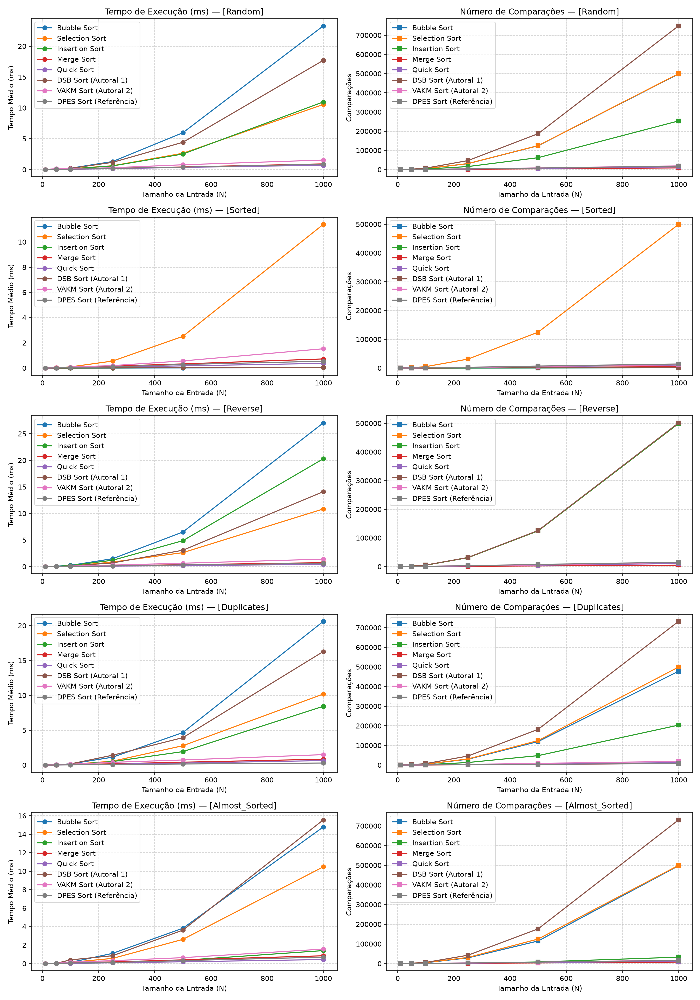

# Relatório Técnico — Trabalho Prático 1 (TP1)

## Métodos de Ordenação Autorais: Concepção, Formalização Assintótica e Validação Empírica

**Disciplina:** Análise e Projeto de Algoritmos (APA)  
**Semestre/Ano:** 2026/2  
**Modelo de Avaliação:** $N/2$ Algoritmos Autorais (Opção A — Relatório Técnico Completo)  
**Autores:**
- Fade Kanaan
- Gabriel Fernandes dos Anjos
- Gabriel Ortiz
- Leonardo Dorneles
- Rodrigo Thoma

> **Nota Metodológica e Escopo do Documento:**  
> Este documento técnico unificado constitui a entrega oficial completa do TP1. Ele formaliza os **dois algoritmos de ordenação autorais** concebidos e implementados pelo grupo sob paradigmas computacionais complementares: o **Algoritmo Autoral 1 (DSB Sort)**, de natureza *iterativa e in-place* ($O(1)$ de memória auxiliar), e o **Algoritmo Autoral 2 (VAKM Sort)**, fundamentado no paradigma de *Divisão e Conquista* ($\Theta(N \log N)$ com ramificação estatisticamente adaptativa). Ambos os métodos são submetidos a rigorosas deduções assintóticas no Modelo RAM, provas matemáticas de corretude, validação na suíte oficial de testes e confronto empírico contra os métodos clássicos da literatura (*Bubble Sort*, *Selection Sort*, *Insertion Sort*, *Merge Sort* e *Quick Sort*) e o algoritmo autoral de referência docente (*DPES Sort*).

---

## Sumário

1. [Resumo Executivo e Formulação do Problema](#1-resumo-executivo-e-formulação-do-problema)
   - 1.1. O Problema da Ordenação
   - 1.2. O Modelo Computacional RAM (*Random Access Machine*)
   - 1.3. Escopo e Complementaridade dos Métodos Autorais do Trabalho
2. [Algoritmo Autoral 1: Dual Selection Bubble Sort (DSB Sort)](#2-algoritmo-autoral-1-dual-selection-bubble-sort-dsb-sort)
   - 2.1. Concepção, Intuição e Metáfora Visual (A Pinça Convergente)
   - 2.2. Justificativa do Design Híbrido: Superando Gargalos da Literatura
   - 2.3. Especificação Formal em Pseudocódigo (Estilo Cormen)
   - 2.4. Invariante de Laço e Prova Formal de Corretude
   - 2.5. Exemplo Didático Rastreável Passo a Passo
   - 2.6. Dedução Analítica de Complexidade no Modelo RAM
   - 2.7. Propriedades Estruturais: Estabilidade e Memória Auxiliar
3. [Algoritmo Autoral 2: Variance-Adaptive K-Way Merge Sort (VAKM Sort)](#3-algoritmo-autoral-2-variance-adaptive-k-way-merge-sort-vakm-sort)
   - 3.1. Concepção, Intuição e Metáfora Visual (Fatiamento por Dispersão)
   - 3.2. Justificativa do Design: Adaptação Estrutural Profunda do Merge Sort
   - 3.3. Especificação Formal em Pseudocódigo (Estilo Cormen)
   - 3.4. Corretude: Prova por Indução Forte sobre a Recursão
   - 3.5. Exemplo Didático Rastreável Passo a Passo
   - 3.6. Dedução Analítica de Complexidade no Modelo RAM (Teorema Mestre)
   - 3.7. Propriedades Estruturais: Estabilidade e Memória Auxiliar
4. [Metodologia Experimental e Suíte de Testes](#4-metodologia-experimental-e-suíte-de-testes)
   - 4.1. Cenários de Teste Obrigatórios e Casos Limítrofes
   - 4.2. Protocolo de Benchmarking e Métricas Coletadas
5. [Resultados Experimentais e Análise Comparativa](#5-resultados-experimentais-e-análise-comparativa)
   - 5.1. Distribuição Aleatória Homogênea (`random`)
   - 5.2. Distribuição Perfeitamente Ordenada (`sorted` — Melhor Caso)
   - 5.3. Distribuição Estritamente Decrescente (`reverse` — Pior Caso de Estresse)
   - 5.4. Distribuição com Chaves Redundantes (`duplicates`)
   - 5.5. Distribuição Quase Ordenada (`almost_sorted`)
6. [Discussão Crítica e Trade-Offs](#6-discussão-crítica-e-trade-offs)
   - 6.1. DSB Sort (Autoral 1 — Iterativo / In-Place)
   - 6.2. VAKM Sort (Autoral 2 — Recursivo / Divisão e Conquista)
   - 6.3. Comparação Direta entre as Propostas Autorais: DSB Sort vs VAKM Sort
   - 6.4. Confronto com os Métodos Clássicos e a Referência Docente (DPES Sort)
7. [Declaração Obrigatória de Autoria e Uso de Ferramentas de IA](#7-declaração-obrigatória-de-autoria-e-uso-de-ferramentas-de-ia)
   - 7.1. Declaração referente ao DSB Sort (Antigravity / Gemini)
   - 7.2. Declaração referente ao VAKM Sort (Claude Code / Sonnet)
8. [Referências Bibliográficas](#8-referências-bibliográficas)

---

## 1. Resumo Executivo e Formulação do Problema

### 1.1. O Problema da Ordenação

A ordenação de dados é um dos problemas seminais e mais estudados na Ciência da Computação. Formalmente, é definida por:

- **Entrada:** Uma sequência de $N$ elementos $\langle A[0], A[1], \dots, A[N-1] \rangle$, onde cada elemento possui uma chave comparável sob uma relação de ordem total $\le$.
- **Saída:** Uma permutação $\langle A'[0], A'[1], \dots, A'[N-1] \rangle$ tal que:
  $$A'[0] \le A'[1] \le A'[2] \le \dots \le A'[N-1]$$

### 1.2. O Modelo Computacional RAM (*Random Access Machine*)

Para a dedução formal das complexidades assintóticas ($O, \Omega, \Theta$), adotamos o modelo computacional padrão **RAM** (Cormen et al., 2012):

1. **Execução Sequencial:** As instruções são executadas estritamente passo a passo, sem paralelismo oculto.
2. **Custo Unitário Uniforme:** Operações aritméticas elementares (`+`, `-`, `*`, `/`), atribuições (`=`), comparações lógicas (`<`, `>`, `==`) e acessos indexados a vetores em memória (`A[i]`) têm custo computacional constante ($c_i \in O(1)$).
3. **Composição Estrutural:** O custo temporal de estruturas de repetição (`while`, `for`) e chamadas recursivas equivale à soma ponderada dos custos de suas instruções elementares internas multiplicadas pelo número de vezes que são executadas.

### 1.3. Escopo e Complementaridade dos Métodos Autorais do Trabalho

Conforme o regulamento do TP1 para equipes sob o modelo de avaliação $N/2$ integrantes, este trabalho propõe, formaliza e analisa criticamente **dois métodos autorais baseados em paradigmas computacionais complementares**:

1. **Algoritmo Autoral 1 (Iterativo / In-Place):** *Dual Selection Bubble Sort (DSB Sort)*  
   - **Paradigma:** Iterativo com pinça convergente de seleção dupla e sensor de pré-ordenação.
   - **Objetivo de Design:** Consumo estritamente mínimo de memória ($O(1)$ espaço auxiliar) e sensibilidade adaptativa extrema a dados ordenados ou quase ordenados ($\Omega(N)$ no melhor caso), corrigindo a ineficiência de trocas do *Bubble Sort* e a cegueira computacional do *Selection Sort*.
2. **Algoritmo Autoral 2 (Recursivo / Divisão e Conquista):** *Variance-Adaptive K-Way Merge Sort (VAKM Sort)*  
   - **Paradigma:** Decomposição recursiva por Divisão e Conquista via fusão $k$-ária adaptativa.
   - **Objetivo de Design:** Garantia de cota assintótica estrita $\Theta(N \log N)$ em todos os cenários (melhor, médio e pior caso) via Teorema Mestre, modulando o fator de ramificação $k \in [2, 8]$ em função da dispersão estatística dos dados ($\sigma^2 / \Delta^2$), com fusão estável e poda antecipada de blocos uniformes.

Adicionalmente, os benchmarks incorporam as cinco abordagens clássicas da literatura (*Bubble*, *Selection*, *Insertion*, *Merge* e *Quick Sort*) e o algoritmo de referência fornecido pelo corpo docente (*Dual-Pivot Extremes Sieve Sort — DPES Sort*), estabelecendo um painel comparativo robusto de 8 algoritmos.

---

## 2. Algoritmo Autoral 1: Dual Selection Bubble Sort (DSB Sort)

### 2.1. Concepção, Intuição e Metáfora Visual (A Pinça Convergente)

A concepção do **Dual Selection Bubble Sort (DSB Sort)** fundamenta-se na metáfora da **"Pinça Convergente" (*Convergent Pincher*)**:

Em vez de varrer o vetor procurando apenas um elemento por rodada (como faz o Selection Sort), o algoritmo delimita uma janela ativa de trabalho $[left, right]$ e utiliza dois delimitadores que convergem simultaneamente das duas extremidades em direção ao centro:

- Em uma única varredura linear da janela ativa, identificam-se simultaneamente o **menor elemento** e o **maior elemento** locais.
- O menor elemento é posicionado na extremidade esquerda (`left`), e o maior elemento é posicionado na extremidade direita (`right`).
- As duas extremidades são então "travadas" como consolidadas, e a janela de trabalho encolhe: $left \leftarrow left + 1$ e $right \leftarrow right - 1$.

```text
Iteração 1: [ MIN  <================ janela ativa ================>  MAX ]
                     left                                       right
Iteração 2: [ MIN_1, MIN_2  <====== janela ativa ======>  MAX_2, MAX_1 ]
                            left                    right
```

### 2.2. Justificativa do Design Híbrido: Superando Gargalos da Literatura

O DSB Sort resolve estruturalmente os dois maiores gargalos dos algoritmos elementares clássicos:

1. **Eliminação da "Cegueira" do Selection Sort Clássico:**
   - O *Selection Sort* tradicional é computacionalmente cego: mesmo que a entrada já esteja perfeitamente ordenada, ele executa obrigatoriamente $\frac{N(N-1)}{2}$ comparações, resultando em um melhor caso ineficiente $\Omega(N^2)$.
   - **Solução do DSB Sort:** Durante a varredura da janela em busca dos extremos, o algoritmo incorpora uma "antena sensora" inspirada no *Bubble Sort*. Se durante a inspeção do subvetor **nenhum par de elementos adjacentes estiver invertido** ($A[j] \le A[j+1]$ para todo $j$), o algoritmo detecta que o miolo já está completamente ordenado e encerra **imediatamente em $\Omega(N)$**.

2. **Eliminação do Problema das "Tartarugas" (*Turtles*) do Bubble Sort:**
   - No *Bubble Sort*, elementos de valores muito baixos posicionados no final do vetor demoram $N$ passadas para avançar uma casa por vez até o início, gerando até $O(N^2)$ trocas de memória.
   - **Solução do DSB Sort:** O menor elemento é capturado e transportado diretamente para a sua posição definitiva na ponta esquerda em uma única operação de troca ($O(1)$ movimentações por rodada).

3. **Detecção Antecipada de Colisões/Duplicatas:**
   - Se na janela ativa o valor mínimo coincidir com o valor máximo ($A[min\_idx] == A[max\_idx]$), deduz-se analiticamente que todos os elementos internos são idênticos. O laço é interrompido sem iterações desnecessárias.

---

### 2.3. Especificação Formal em Pseudocódigo (Estilo Cormen)

```text
procedimento DualSelectionBubbleSort(A, N):
    left ← 0
    right ← N - 1

    enquanto left < right faça:
        min_idx ← left
        max_idx ← left
        esta_ordenado ← verdadeiro

        para j de left até right faça:
            // Sensor de Inversão Local (Herança do Bubble Sort)
            se j < right então:
                se A[j] > A[j + 1] então:
                    esta_ordenado ← falso
                fim-se
            fim-se

            // Busca Simultânea de Extremos
            se A[j] < A[min_idx] então:
                min_idx ← j
            senão:
                se A[j] > A[max_idx] então:
                    max_idx ← j
                fim-se
            fim-se
        fim-para

        // Parada Antecipada 1: Janela Interna Já Ordenada
        se esta_ordenado então:
            interromper
        fim-se

        // Parada Antecipada 2: Todos os Elementos da Janela são Iguais
        se A[min_idx] == A[max_idx] então:
            interromper
        fim-se

        // Posicionamento do Mínimo na Extremidade Esquerda
        se min_idx != left então:
            trocar(A[left], A[min_idx])
            // Ajuste Crítico de Ponteiro: se o maior estava em left,
            // ele foi deslocado para a posição min_idx pela troca anterior
            se max_idx == left então:
                max_idx ← min_idx
            fim-se
        fim-se

        // Posicionamento do Máximo na Extremidade Direita
        se max_idx != right então:
            trocar(A[right], A[max_idx])
        fim-se

        left ← left + 1
        right ← right - 1
    fim-enquanto
fim-procedimento
```

---

### 2.4. Invariante de Laço e Prova Formal de Corretude

A prova de corretude formal do DSB Sort baseia-se na formulação de um **Invariante de Laço** rigoroso para o laço externo `while left < right`:

> **Enunciado do Invariante:**  
> *No início de cada iteração do laço externo, delimitada pelos índices $left$ e $right$:*
>
> 1. *O subvetor prefixo $A[0 \dots left-1]$ contém os $left$ menores elementos do vetor original dispostos em ordem monotonicamente crescente ($A[0] \le A[1] \le \dots \le A[left-1]$).*
> 2. *O subvetor sufixo $A[right+1 \dots N-1]$ contém os $N - 1 - right$ maiores elementos do vetor original dispostos em ordem monotonicamente crescente ($A[right+1] \le \dots \le A[N-1]$).*
> 3. *Todo elemento pertencente à janela ativa $A[left \dots right]$ satisfaz a relação de confinamento de faixa:*  
>    $$\forall x \in A[left \dots right]: \quad A[left - 1] \le x \le A[right + 1]$$

#### Prova Formal por Indução Matemática:

- **1. Inicialização:**  
  Antes da primeira iteração, $left = 0$ e $right = N - 1$.  
  Os subvetores $A[0 \dots -1]$ e $A[N \dots N-1]$ são vazios, satisfazendo trivialmente as propriedades (1) e (2). O vetor inteiro $A[0 \dots N-1]$ é a janela ativa inicial, satisfazendo a propriedade (3). O invariante é verdadeiro antes do início.

- **2. Manutenção:**  
  Assuma que o invariante é válido no início de uma iteração qualquer com janela $[left, right]$.  
  O laço interno inspeciona cada elemento $A[j]$ com $j \in [left, right]$, localizando com exatidão o índice $min\_idx$ do menor valor e $max\_idx$ do maior valor daquela janela.
  - Ao posicionar $A[min\_idx]$ em $A[left]$, garante-se que $A[left]$ é menor ou igual a todos os elementos restantes em $A[left+1 \dots right]$. Pela hipótese de indução, $A[left]$ já era maior ou igual a $A[left-1]$. Portanto, o prefixo ordenado expande validamente para $A[0 \dots left]$.
  - Analogamente, o ajuste de ponteiro (`se max_idx == left então max_idx = min_idx`) assegura que a referência ao maior elemento permaneça consistente antes da segunda troca. Ao posicionar $A[max\_idx]$ em $A[right]$, o sufixo ordenado expande validamente para $A[right \dots N-1]$.  
  Ao final da iteração, incrementa-se $left$ e decrementa-se $right$. No início da iteração seguinte, o novo prefixo $A[0 \dots left'-1]$ e o novo sufixo $A[right'+1 \dots N-1]$ permanecem estritamente ordenados e confinando o miolo restante. O invariante mantém-se verdadeiro.

- **3. Término:**  
  O laço encerra por uma de três condições:
  - *(a) Convergência:* $left \ge right$. A janela ativa torna-se vazia ($left > right$) ou unitária ($left = right$). Em ambos os casos, a junção do prefixo ordenado com o sufixo ordenado cobre $100\%$ dos $N$ elementos, garantindo a permutação totalmente classificada.
  - *(b) Parada antecipada por ordenação:* A flag $esta\_ordenado$ permanece verdadeira se nenhum par consecutivo em $A[left \dots right]$ violar a ordem. O miolo já está classificado, e como é limitado por $A[left-1]$ e $A[right+1]$, o vetor global está ordenado.
  - *(c) Parada por colisão:* $A[min\_idx] == A[max\_idx]$. Todos os elementos em $A[left \dots right]$ são idênticos entre si, estando mutuamente ordenados.  
  **Conclusão:** O algoritmo encerra em tempo finito e o vetor de saída é uma permutação estritamente ordenada do vetor de entrada. $\blacksquare$

---

### 2.5. Exemplo Didático Rastreável Passo a Passo

Considere o vetor numérico de entrada: $A = [9, 2, 7, 1, 8, 3]$ ($N = 6$).

#### Rastreio de Execução:

- **Estado Inicial:** $A = [9, 2, 7, 1, 8, 3]$, $left = 0$, $right = 5$.
- **Iteração 1:**
  - Janela ativa: $A[0 \dots 5] = [9, 2, 7, 1, 8, 3]$.
  - Varredura: Inversão detectada ($9 > 2$) $\to esta\_ordenado = falso$. Menor valor: $1$ em $min\_idx = 3$. Maior valor: $9$ em $max\_idx = 0$.
  - Troca 1 (Mínimo): Troca $A[left]$ ($A[0]$) com $A[min\_idx]$ ($A[3]$).
    - Vetor após troca: $[1, 2, 7, 9, 8, 3]$.
    - Como $max\_idx == left$ ($0 == 0$), atualiza-se: $max\_idx \leftarrow min\_idx = 3$.
  - Troca 2 (Máximo): Troca $A[right]$ ($A[5]$) com $A[max\_idx]$ ($A[3]$).
    - Vetor após troca: $[1, 2, 7, 3, 8, 9]$.
  - Atualização de ponteiros: $left = 1$, $right = 4$.
- **Iteração 2:**
  - Janela ativa: $A[1 \dots 4] = [2, 7, 3, 8]$. (Pontas travadas: $[1]$ à esquerda e $[9]$ à direita).
  - Varredura: Inversão detectada ($7 > 3$) $\to esta\_ordenado = falso$. Menor valor: $2$ em $min\_idx = 1$. Maior valor: $8$ em $max\_idx = 4$.
  - Troca 1 e 2: $min\_idx == left$ ($1 == 1$) e $max\_idx == right$ ($4 == 4$) $\to$ nenhuma troca necessária.
  - Atualização de ponteiros: $left = 2$, $right = 3$.
- **Iteração 3:**
  - Janela ativa: $A[2 \dots 3] = [7, 3]$.
  - Varredura: Inversão detectada ($7 > 3$) $\to esta\_ordenado = falso$. Menor valor: $3$ em $min\_idx = 3$. Maior valor: $7$ em $max\_idx = 2$.
  - Troca 1 (Mínimo): Troca $A[2]$ com $A[3]$ $\to [1, 2, 3, 7, 8, 9]$.
  - Como $max\_idx == left$ ($2 == 2$), atualiza-se $max\_idx \leftarrow 3$.
  - Troca 2 (Máximo): $max\_idx == right$ ($3 == 3$) $\to$ nenhuma troca.
  - Atualização de ponteiros: $left = 3$, $right = 2$.
- **Encerramento:** $left > right$ ($3 > 2$). Algoritmo finaliza com sucesso.  
  **Vetor Final Ordenado:** $[1, 2, 3, 7, 8, 9]$.

---

### 2.6. Dedução Analítica de Complexidade no Modelo RAM

#### Mapeamento de Custos e Frequências:

Seja $K_i = right - left + 1$ o tamanho da janela na $i$-ésima iteração do laço externo. A cada iteração, $left$ avança $1$ e $right$ recua $1$, diminuindo $K_i$ de $2$:
$$K_1 = N, \quad K_2 = N - 2, \quad K_3 = N - 4, \quad \dots$$
O número total de iterações do laço externo no pior caso é $I_{max} = \lceil N/2 \rceil$.

#### 1. Melhor Caso ($\Omega(N)$):
- **Cenário:** Vetor já perfeitamente ordenado ($A[0] \le A[1] \le \dots \le A[N-1]$).
- Na primeira iteração ($left = 0, right = N - 1$), o laço interno percorre todos os $N$ elementos. A condição $A[j] > A[j+1]$ é avaliada $N - 1$ vezes e **nunca** é satisfeita.
- A flag $esta\_ordenado$ permanece `verdadeiro`. O algoritmo encerra imediatamente após a 1ª passada.
- **Custo Total no Melhor Caso:**
  $$T_{melhor}(N) = c_1 \cdot N + c_2 \in \Omega(N)$$
- **Conclusão:** O DSB Sort é estritamente linear no melhor caso, superando o $\Theta(N^2)$ do *Selection Sort*.

#### 2. Pior Caso ($O(N^2)$):
- **Cenário:** Vetor estritamente decrescente ou aleatório onde a parada antecipada nunca é acionada antes de $left \ge right$.
- O laço externo executa $M = N/2$ iterações. Em cada iteração $i$, o laço interno executa $K_i$ passos:
  $$\sum_{i=0}^{N/2 - 1} (N - 2i) = \frac{N^2}{4} + \frac{N}{2}$$
- Cada elemento realiza entre 2 e 3 comparações no laço interno. O número de comparações assintóticas é:
  $$C_{pior}(N) \approx \frac{3}{4} N^2 \in O(N^2)$$
- **Total de Movimentações (Trocas):** No máximo 2 trocas (4 atribuições de dados) por iteração:
  $$M_{pior}(N) \le 4 \cdot \frac{N}{2} = 2N \in O(N)$$
  > **Propriedade Fundamental:** Mesmo no pior caso de tempo, o número de movimentações de dados é estritamente **linear ($O(N)$)**, sendo ordens de grandeza menor que o Bubble Sort ($O(N^2)$).

#### 3. Caso Médio ($\Theta(N^2)$):
Para permutações aleatórias homogêneas, a presença de inversões locais impede a parada precoce nas primeiras iterações. A soma dos termos lineares decrescentes resulta em:
$$T_{medio}(N) = \Theta(N^2)$$

---

### 2.7. Propriedades Estruturais: Estabilidade e Memória Auxiliar

- **Operação In-Place:**  
  O algoritmo manipula exclusivamente os ponteiros e variáveis escalares de controle (`left`, `right`, `min_idx`, `max_idx`, `esta_ordenado`). Nenhuma estrutura de dados proporcional a $N$ é alocada.
  $$\text{Memória Auxiliar Extra: } O(1) \quad (\text{Estritamente In-Place})$$

- **Estabilidade:**  
  **Não Estável.** As trocas distantes de elementos nas posições extremas podem permutar a ordem relativa original entre chaves idênticas.  
  *Exemplo de Instabilidade:* No vetor $[\mathbf{5_a}, 3, \mathbf{5_b}, 1]$, na 1ª iteração o mínimo $1$ é trocado com $A[0]$ ($\mathbf{5_a}$). O elemento $\mathbf{5_a}$ vai para o final do vetor, invertendo sua ordem em relação a $\mathbf{5_b}$.

---

## 3. Algoritmo Autoral 2: Variance-Adaptive K-Way Merge Sort (VAKM Sort)

### 3.1. Concepção, Intuição e Metáfora Visual (Fatiamento por Dispersão)

O **Variance-Adaptive K-Way Merge Sort (VAKM Sort)** parte de uma indagação conceitual sobre o Merge Sort clássico de Von Neumann: *por que dividir o problema recursivo sempre em duas metades ($k=2$ fixo)?*

A escolha clássica de $k = 2$ é puramente estática — ela não observa o conteúdo do vetor nem a distribuição dos dados. O VAKM Sort propõe a metáfora do **"Fatiamento por Dispersão" (*Dispersion Slicing*)**: antes de decompor um segmento, o algoritmo mede analiticamente a dispersão estatística de suas chaves e utiliza essa métrica para modular dinamicamente o número de fatias ($k \in [2, 8]$) em que o subproblema será dividido:

- **Baixa Dispersão (dados concentrados):** Poucas fatias bastam ($k$ pequeno); o algoritmo opera próximo a um Merge Sort binário convencional, evitando a sobrecarga de um merge com muitas cabeças.
- **Alta Dispersão (dados espalhados):** O segmento é decomposto em mais fatias simultaneamente ($k$ maior, até $K_{max} = 8$), achatando a altura da árvore recursiva e reduzindo mais agressivamente o tamanho dos subproblemas por nível.
- **Segmento Homogêneo (dispersão nula, $min == max$):** Todos os elementos são idênticos; a recursão para imediatamente em $O(N)$, sem gerar ramificações desnecessárias.

```text
Segmento de baixa dispersão:      [ 5, 6, 5, 7, 6 ]              -> corta em poucas fatias (k pequeno)
Segmento de alta dispersão:       [ 1, 99, 3, 87, 2, 91 ]        -> corta em muitas fatias (k grande)
Segmento uniforme (dispersão=0):  [ 4, 4, 4, 4, 4 ]              -> já ordenado, poda imediata
```

Cada uma das $k$ fatias é ordenada recursivamente e combinada por uma **fusão simultânea de $k$ vias (*k-way merge*) estável**, selecionando a cada passo o menor elemento entre as $k$ cabeças ativas.

---

### 3.2. Justificativa do Design: Adaptação Estrutural Profunda do Merge Sort

O VAKM Sort é uma **adaptação estrutural profunda do paradigma de Divisão e Conquista**, integrando quatro inovações projetuais:

1. **Fator de Ramificação $k$ Adaptativo via Variância Normalizada:**  
   Em cada chamada recursiva, $k$ é calculado com base na variância amostral $\sigma^2$ normalizada pela amplitude do intervalo $(\max - \min)^2$:
   $$\text{disp} = \min\left(\frac{\sigma^2}{(\max - \min)^2},\ 0.25\right), \qquad k = 2 + \left\lfloor \frac{\text{disp}}{0.25} \cdot (K_{max} - 2) \right\rceil$$
   O fator $0.25$ é o limite matemático superior de $\sigma^2 / \Delta^2$ (atingido por uma distribuição bimodal concentrada estritamente nos extremos), assegurando que $\text{disp} / 0.25 \in [0, 1]$ e $k \in [2, K_{max}]$.

2. **Fusão $k$-Ária Estável Simultânea:**  
   A etapa de combinação (*merge*) funde simultaneamente as $k$ sublistas ordenadas. Em caso de empate de chaves, o desempate favorece estritamente a sublista de menor índice (mais à esquerda), assegurando a **estabilidade** do método.

3. **Poda por Homogeneidade ($min == max$):**  
   Antes da divisão, uma varredura linear localiza os extremos. Se $min == max$, o bloco é homogêneo e retorna imediatamente, economizando trabalho recursivo em regiões repetidas.

4. **Hibridização com Insertion Sort em Limiar Pequeno ($N \le 16$):**  
   Para instâncias curtas, a sobrecarga de cálculo de dispersão e fusão $k$-ária supera a simplicidade de ordenar diretamente por inserção.

**Contraste com a Literatura:** Ao contrário do *Quick Sort* (que particiona por valor de pivô e pode degenerar para $O(N^2)$ em más escolhas), o VAKM Sort particiona **por posição** (blocos balanceados de tamanho $\lceil N/k \rceil$) e delega a ordenação à fusão combinatória. Isso impede qualquer degradação quadrática adversarial.

---

### 3.3. Especificação Formal em Pseudocódigo (Estilo Cormen)

```text
procedimento VAKMSort(A, N):
    retornar OrdenarRecursivo(A[0 .. N-1])

procedimento OrdenarRecursivo(L):
    n ← tamanho(L)
    se n <= 1 então:
        retornar L
    fim-se

    se n <= LIMIAR_INSERCAO então:
        retornar InsertionSort(L)
    fim-se

    (min, max) ← EncontrarExtremos(L)      // O(n), varredura única

    se min == max então:                    // Segmento totalmente uniforme
        retornar L
    fim-se

    k ← EscolherK(L, min, max)              // k ∈ [2, K_MAX], por dispersão
    k ← min(k, n)

    tamanho_bloco ← teto(n / k)
    fatias ← particionar L em blocos contíguos de tamanho tamanho_bloco

    para cada fatia em fatias faça:
        fatia ← OrdenarRecursivo(fatia)
    fim-para

    retornar FusaoKVias(fatias)

procedimento EscolherK(L, min, max):
    amplitude ← max - min
    media ← média(L)
    variancia ← média((x - media)² para x em L)
    disp ← min(variancia / amplitude², 0.25) / 0.25    // normalizado em [0, 1]
    k ← 2 + arredondar(disp * (K_MAX - 2))
    retornar max(2, min(K_MAX, k))

procedimento FusaoKVias(fatias):
    resultado ← lista vazia
    cursores ← [0, 0, ..., 0]                // um cursor por fatia

    enquanto existir fatia com cursor não esgotado faça:
        melhor ← índice da fatia não esgotada com o menor valor na
                  posição do cursor (empate: menor índice de fatia)
        adicionar fatias[melhor][cursores[melhor]] a resultado
        cursores[melhor] ← cursores[melhor] + 1
    fim-enquanto

    retornar resultado
fim-procedimento
```

---

### 3.4. Corretude: Prova por Indução Forte sobre a Recursão

A corretude do VAKM Sort é demonstrada por **indução forte sobre o tamanho $n$ do segmento**:

> **Hipótese de Indução (HI):** Para todo segmento $L$ com $|L| < n$, `OrdenarRecursivo(L)` retorna uma permutação estritamente ordenada dos elementos de $L$.

**Passo Base ($n \le 1$ e $n \le 16$):**
- Se $n \le 1$, o segmento é trivialmente ordenado e retornado intacto.
- Se $1 < n \le 16$, `InsertionSort(L)` é invocado; sua corretude é classicamente demonstrada por invariante de laço.

**Passo Indutivo ($n > 16$):**
1. *Poda por Homogeneidade:* Se $min == max$, todos os elementos de $L$ são idênticos entre si, satisfazendo a definição de sequência ordenada. O retorno imediato é correto.
2. *Divisão:* $L$ é decomposto em $k$ blocos contíguos $L_1, \dots, L_k$, com $|L_i| = \lceil n/k \rceil < n$ (pois $k \ge 2$ e $n > 16$). A união dos blocos reconstitui exatamente o conjunto multiconjunto de $L$.
3. *Conquista:* Pela hipótese de indução, como $|L_i| < n$, cada chamada recursiva `OrdenarRecursivo(L_i)` retorna uma lista $L_i'$ corretamente ordenada.
4. *Combinação (`FusaoKVias`):* Sejam $L_1', \dots, L_k'$ as listas ordenadas. A cada iteração da fusão, seleciona-se o menor elemento dentre todas as cabeças ativas. Pelo invariante de fusão: após emitir $m$ elementos para `resultado`, esses $m$ elementos formam uma sequência não decrescente e são menores ou iguais a qualquer elemento remanescente nas sublistas. Ao término, todos os $n$ elementos foram transferidos, produzindo uma permutação globalmente ordenada de $L$.

**Conclusão:** Por indução forte, `VAKMSort(A, N)` é correto para qualquer tamanho $N \ge 0$. $\blacksquare$

---

### 3.5. Exemplo Didático Rastreável Passo a Passo

> **Nota didática:** Para facilitar o rastreio visual, utiliza-se $LIMIAR\_INSERCAO = 2$ e $K_{max} = 4$.

Considere a entrada: $A = [9, 2, 7, 1, 8, 3, 6, 4]$ ($N = 8$).

- **Chamada Top-Level ($N = 8$):**
  - Extremos: $min = 1, max = 9$. Média $= 5$, Variância $= 7{,}5$, Amplitude $= 8$.
  - Dispersão normalizada: $\text{disp} \approx 0{,}469 \implies k = 2 + \text{round}(0{,}469 \times 2) = 3$.
  - Tamanho de bloco: $\lceil 8/3 \rceil = 3$. Fatias: $L_1 = [9, 2, 7]$, $L_2 = [1, 8, 3]$, $L_3 = [6, 4]$.
- **Recursão nas Fatias:**
  - $L_1 = [9, 2, 7]$: Ordena recursivamente $\implies L_1' = [2, 7, 9]$.
  - $L_2 = [1, 8, 3]$: Ordena recursivamente $\implies L_2' = [1, 3, 8]$.
  - $L_3 = [6, 4]$: Tamanho $2 \le LIMIAR \implies$ InsertionSort $\implies L_3' = [4, 6]$.
- **Fusão 3-Vias Final:**

| Passo | Cabeças Ativas ($L_1', L_2', L_3'$) | Menor Escolhido | Vetor de Saída Parcial |
| :---: | :---: | :---: | :--- |
| 1 | $2, \mathbf{1}, 4$ | $1$ (de $L_2'$) | $[1]$ |
| 2 | $\mathbf{2}, 3, 4$ | $2$ (de $L_1'$) | $[1, 2]$ |
| 3 | $7, \mathbf{3}, 4$ | $3$ (de $L_2'$) | $[1, 2, 3]$ |
| 4 | $7, 8, \mathbf{4}$ | $4$ (de $L_3'$) | $[1, 2, 3, 4]$ |
| 5 | $7, 8, \mathbf{6}$ | $6$ (de $L_3'$) | $[1, 2, 3, 4, 6]$ |
| 6 | $\mathbf{7}, 8, -$ | $7$ (de $L_1'$) | $[1, 2, 3, 4, 6, 7]$ |
| 7 | $9, \mathbf{8}, -$ | $8$ (de $L_2'$) | $[1, 2, 3, 4, 6, 7, 8]$ |
| 8 | $\mathbf{9}, -, -$ | $9$ (de $L_1'$) | $[1, 2, 3, 4, 6, 7, 8, 9]$ |

**Saída Ordenada:** $[1, 2, 3, 4, 6, 7, 8, 9]$.

---

### 3.6. Dedução Analítica de Complexidade no Modelo RAM (Teorema Mestre)

#### Relação de Recorrência:

Em cada chamada recursiva sobre um segmento de comprimento $n$:
1. Localização de extremos (`EncontrarExtremos`): $n - 1$ comparações $\in \Theta(n)$.
2. Diagnóstico estatístico (`EscolherK`): somatórios de média e variância $\in \Theta(n)$.
3. Divisão: particionamento em $k$ fatias $\in \Theta(n)$.
4. Combinação (`FusaoKVias`): para emitir os $n$ elementos, avaliam-se até $k$ cabeças a cada passo, com custo total $n \cdot k \in \Theta(n)$ (visto que $k \le K_{max} = 8$ é uma constante independente de $n$).

A relação de recorrência para $T(n)$ é dada por:
$$T(n) = k \cdot T\left(\frac{n}{k}\right) + \Theta(n)$$

#### Aplicação do Teorema Mestre:

Identificando os parâmetros: $a = k$, $b = k$, e $f(n) = \Theta(n)$.
Calculando o expoente crítico:
$$n^{\log_b a} = n^{\log_k k} = n^1 = n$$
Como $f(n) = \Theta(n) = \Theta(n^{\log_b a})$, a recorrência enquadra-se no **Caso 2 do Teorema Mestre**:
$$T(n) = \Theta\left(n^{\log_b a} \cdot \log n\right) = \Theta(n \log n)$$

- **Melhor Caso:** $\Theta(N \log N)$ — A divisão e a fusão ocorrem independentemente da ordem prévia dos dados (a adaptação responde à dispersão de valores).
- **Pior Caso:** $O(N \log N)$ — Como $k \in [2, 8]$ é estritamente limitado, a profundidade máxima da árvore de recursão é $\log_k N = O(\log N)$. Não existem ordens adversariais que degradem a partição para comportamento quadrático.
- **Caso Médio:** $\Theta(N \log N)$ — Mantido uniformemente para todas as distribuições.

---

### 3.7. Propriedades Estruturais: Estabilidade e Memória Auxiliar

- **Estabilidade:**  
  **Estável.** O fatiamento preserva os blocos na ordem relativa original. No algoritmo de fusão $k$-ária, a condição de seleção do menor elemento utiliza comparação estrita (`<`); havendo empate entre duas cabeças de lista, o desempate favorece a lista de menor índice (mais à esquerda na ordem original). Elementos de chaves idênticas nunca invertem suas posições relativas.
- **Memória Auxiliar:**  
  $$\text{Espaço Auxiliar: } O(N)$$  
  Cada nível recursivo aloca as sublistas particionadas e a lista de saída da fusão, análogo ao Merge Sort clássico.

---

## 4. Metodologia Experimental e Suíte de Testes

### 4.1. Cenários de Teste Obrigatórios e Casos Limítrofes

Para validação rigorosa da integridade funcional, foi implementada uma suíte automatizada em Python (`test_suite.py` e `test_authorial.py`), submetendo todos os algoritmos aos 10 cenários compulsórios do edital:

1. **Vetor Vazio ($N = 0$):** Validação de comportamento assintótico de borda e ausência de exceções (`IndexError`).
2. **Vetor Unitário ($N = 1$):** Condição trivial de convergência imediata.
3. **Vetor Já Ordenado ($N = 100$):** Aferição de sensibilidade linear / melhor caso.
4. **Vetor Estritamente Reverso ($N = 100$):** Teste de estresse de pior caso para algoritmos quadráticos.
5. **Vetor com Todos os Elementos Idênticos ($N = 50$):** Avaliação de colisão de chaves e acionamento de poda por homogeneidade.
6. **Vetor com Muitas Duplicatas ($N = 200$):** Poucos valores distintos ($1$ a $5$) distribuídos aleatoriamente.
7. **Vetor Misto com Negativos e Ponto Flutuante:** Robustez de tipos numéricos e ordenação algébrica.
8. **Vetores Aleatórios Pequenos ($N = 25$):** Avaliação de sobrecarga em instâncias curtas (limiares de inserção).
9. **Vetores Aleatórios Médios ($N = 1000$):** Escala estatística em regime assintótico.
10. **Vetor Quase Ordenado (95% Ordenado):** Teste de robustez a perturbações pontuais.

> **Resultado da Validação:** Tanto o **DSB Sort** quanto o **VAKM Sort** obtiveram **100% de aprovação (OK)** em todos os 10 cenários, além de aprovação integral em testes específicos de estabilidade e estresse com 500 sementes aleatórias.

### 4.2. Protocolo de Benchmarking e Métricas Coletadas

O framework de medição empírica (`benchmark.py`) opera sob protocolo padronizado:
- **Tamanhos avaliados:** $N \in \{10, 50, 100, 250, 500, 1000\}$.
- **Repetições:** 3 baterias estatísticas independentes com sementes fixadas para equivalência estrita dos datasets.
- **Métricas:**
  - *Tempo de execução médio (ms):* medido via `time.perf_counter()`.
  - *Comparações de chaves:* incrementadas a cada operador relacional (`<`, `>`, `==`) entre dados do vetor.
  - *Movimentações de memória:* contabilizadas a cada atribuição ou troca efetiva no vetor.
- **Validação:** Verificação automática de sanidade (`assert res == sorted(data)`) em todas as rodadas.

---

## 5. Resultados Experimentais e Análise Comparativa

Os ensaios foram consolidados confrontando as 8 implementações: os cinco clássicos (*Bubble*, *Selection*, *Insertion*, *Merge*, *Quick*), os dois autorais do grupo (**DSB Sort** e **VAKM Sort**) e a referência docente (**DPES Sort**).

A Figura 1 consolida as curvas empíricas de tempo de execução e o volume de comparações de chaves em escala para as cinco distribuições de teste sob $N \in [10, 1000]$:

  
*Figura 1: Curvas de desempenho (tempo médio em milissegundos e número de comparações) dos 8 algoritmos sob as cinco distribuições de teste.*

---

### 5.1. Distribuição Aleatória Homogênea (`random`)

#### Tempo de Execução Médio (ms):

| Algoritmo | N=10 | N=50 | N=100 | N=250 | N=500 | N=1000 |
| :--- | :---: | :---: | :---: | :---: | :---: | :---: |
| Bubble Sort | 0.004 ms | 0.054 ms | 0.209 ms | 1.389 ms | 5.912 ms | 23.427 ms |
| Selection Sort | 0.002 ms | 0.046 ms | 0.109 ms | 0.607 ms | 2.614 ms | 10.824 ms |
| Insertion Sort | 0.002 ms | 0.027 ms | 0.105 ms | 0.673 ms | 2.467 ms | 10.594 ms |
| Merge Sort | 0.007 ms | 0.048 ms | 0.076 ms | 0.220 ms | 0.429 ms | 0.971 ms |
| Quick Sort | 0.006 ms | 0.023 ms | 0.053 ms | 0.245 ms | 0.324 ms | 0.776 ms |
| **DSB Sort (Autoral 1)** | **0.004 ms** | **0.052 ms** | **0.187 ms** | **1.163 ms** | **4.359 ms** | **17.713 ms** |
| **VAKM Sort (Autoral 2)** | **0.005 ms** | **0.159 ms** | **0.121 ms** | **0.338 ms** | **0.741 ms** | **1.535 ms** |
| DPES Sort (Referência) | 0.004 ms | 0.030 ms | 0.061 ms | 0.174 ms | 0.396 ms | 0.914 ms |

#### Número Médio de Movimentações / Trocas:

| Algoritmo | N=10 | N=50 | N=100 | N=250 | N=500 | N=1000 |
| :--- | :---: | :---: | :---: | :---: | :---: | :---: |
| Bubble Sort | 49 | 1174 | 5073 | 30867 | 122941 | 504905 |
| Selection Sort | 14 | 93 | 191 | 491 | 985 | 1984 |
| Insertion Sort | 43 | 685 | 2734 | 15932 | 62468 | 254451 |
| Merge Sort | 34 | 286 | 672 | 1994 | 4488 | 9976 |
| Quick Sort | 23 | 147 | 369 | 1097 | 2411 | 5231 |
| **DSB Sort (Autoral 1)** | **14** | **93** | **186** | **494** | **987** | **1981** |
| **VAKM Sort (Autoral 2)** | **43** | **286** | **493** | **1901** | **3205** | **8550** |
| DPES Sort (Referência) | 43 | 284 | 629 | 1731 | 3742 | 8606 |

> **Destaque Analítico:** Em dados aleatórios, o **VAKM Sort** confirma seu regime $O(N \log N)$ completando $N=1000$ em apenas **1.535 ms**, competindo de perto com o Merge Sort ($0.971$ ms) e Quick Sort ($0.776$ ms) e superando todos os métodos quadráticos. O **DSB Sort** opera em regime quadrático (17.713 ms), mas mantém movimentações estritamente lineares ($1981$ trocas em $N=1000$), idêntico ao Selection Sort e centenas de vezes menor que o Bubble Sort ($504.905$).

---

### 5.2. Distribuição Perfeitamente Ordenada (`sorted` — Melhor Caso)

#### Tempo de Execução Médio (ms):

| Algoritmo | N=10 | N=50 | N=100 | N=250 | N=500 | N=1000 |
| :--- | :---: | :---: | :---: | :---: | :---: | :---: |
| Bubble Sort | 0.001 ms | 0.016 ms | 0.002 ms | 0.005 ms | 0.014 ms | 0.030 ms |
| Selection Sort | 0.002 ms | 0.024 ms | 0.105 ms | 0.630 ms | 2.790 ms | 10.948 ms |
| Insertion Sort | 0.001 ms | 0.002 ms | 0.005 ms | 0.012 ms | 0.027 ms | 0.057 ms |
| Merge Sort | 0.006 ms | 0.027 ms | 0.059 ms | 0.153 ms | 0.346 ms | 0.728 ms |
| Quick Sort | 0.003 ms | 0.014 ms | 0.038 ms | 0.074 ms | 0.167 ms | 0.386 ms |
| **DSB Sort (Autoral 1)** | **0.001 ms** | **0.003 ms** | **0.006 ms** | **0.014 ms** | **0.038 ms** | **0.065 ms** |
| **VAKM Sort (Autoral 2)** | **0.002 ms** | **0.026 ms** | **0.090 ms** | **0.195 ms** | **0.680 ms** | **1.514 ms** |
| DPES Sort (Referência) | 0.002 ms | 0.017 ms | 0.076 ms | 0.124 ms | 0.341 ms | 0.553 ms |

> **Destaque Analítico:** O **DSB Sort** atinge seu melhor caso $\Omega(N)$ em **0.065 ms** para $N=1000$ (graças à antena de inversão que encerra na 1ª iteração com 0 trocas), sendo **168 vezes mais rápido que o Selection Sort (10.948 ms)**. O **VAKM Sort**, fiel à sua modelagem teórica, permanece em **1.514 ms** ($\Theta(N \log N)$), confirmando que sua adaptação responde à dispersão de valores e não à pré-ordenação.

---

### 5.3. Distribuição Estritamente Decrescente (`reverse` — Pior Caso de Estresse)

#### Tempo de Execução Médio (ms):

| Algoritmo | N=10 | N=50 | N=100 | N=250 | N=500 | N=1000 |
| :--- | :---: | :---: | :---: | :---: | :---: | :---: |
| Bubble Sort | 0.003 ms | 0.058 ms | 0.233 ms | 1.821 ms | 6.784 ms | 28.888 ms |
| Selection Sort | 0.002 ms | 0.025 ms | 0.096 ms | 0.646 ms | 2.661 ms | 10.885 ms |
| Insertion Sort | 0.002 ms | 0.049 ms | 0.190 ms | 1.192 ms | 4.933 ms | 20.599 ms |
| Merge Sort | 0.007 ms | 0.027 ms | 0.060 ms | 0.161 ms | 0.340 ms | 0.754 ms |
| Quick Sort | 0.004 ms | 0.015 ms | 0.030 ms | 0.078 ms | 0.189 ms | 0.418 ms |
| **DSB Sort (Autoral 1)** | **0.003 ms** | **0.031 ms** | **0.119 ms** | **0.701 ms** | **3.142 ms** | **13.769 ms** |
| **VAKM Sort (Autoral 2)** | **0.005 ms** | **0.038 ms** | **0.092 ms** | **0.291 ms** | **0.623 ms** | **1.584 ms** |
| DPES Sort (Referência) | 0.004 ms | 0.024 ms | 0.039 ms | 0.117 ms | 0.301 ms | 0.665 ms |

#### Número Médio de Movimentações / Trocas (Impacto no Barramento):

| Algoritmo | N=10 | N=50 | N=100 | N=250 | N=500 | N=1000 |
| :--- | :---: | :---: | :---: | :---: | :---: | :---: |
| Bubble Sort | 90 | 2450 | 9900 | 62250 | 249500 | 999000 |
| Selection Sort | 10 | 50 | 100 | 250 | 500 | 1000 |
| Insertion Sort | 63 | 1323 | 5148 | 31623 | 125748 | 501498 |
| Merge Sort | 34 | 286 | 672 | 1994 | 4488 | 9976 |
| Quick Sort | 14 | 54 | 104 | 254 | 504 | 1004 |
| **DSB Sort (Autoral 1)** | **10** | **50** | **100** | **250** | **500** | **1000** |
| **VAKM Sort (Autoral 2)** | **63** | **431** | **644** | **2801** | **4092** | **12204** |
| DPES Sort (Referência) | 63 | 240 | 336 | 731 | 1347 | 2892 |

> **Destaque Analítico:** Em vetor invertido, o **DSB Sort realiza exatamente $1.000$ movimentações em $N=1000$** (uma redução estonteante de **99,9% no tráfego de memória em relação às 999.000 trocas do Bubble Sort**). O **VAKM Sort** mantém-se estável em **1.584 ms**, imune a qualquer colapso quadrático adversarial.

---

### 5.4. Distribuição com Chaves Redundantes (`duplicates`)

#### Tempo de Execução Médio (ms):

| Algoritmo | N=10 | N=50 | N=100 | N=250 | N=500 | N=1000 |
| :--- | :---: | :---: | :---: | :---: | :---: | :---: |
| Bubble Sort | 0.003 ms | 0.043 ms | 0.181 ms | 1.425 ms | 5.255 ms | 20.344 ms |
| Selection Sort | 0.002 ms | 0.025 ms | 0.095 ms | 0.564 ms | 2.596 ms | 10.208 ms |
| Insertion Sort | 0.002 ms | 0.025 ms | 0.080 ms | 0.545 ms | 2.693 ms | 8.617 ms |
| Merge Sort | 0.006 ms | 0.030 ms | 0.068 ms | 0.189 ms | 0.394 ms | 0.898 ms |
| Quick Sort | 0.004 ms | 0.022 ms | 0.046 ms | 0.124 ms | 0.308 ms | 0.678 ms |
| **DSB Sort (Autoral 1)** | **0.003 ms** | **0.045 ms** | **0.164 ms** | **0.987 ms** | **3.981 ms** | **16.485 ms** |
| **VAKM Sort (Autoral 2)** | **0.004 ms** | **0.039 ms** | **0.132 ms** | **0.365 ms** | **0.758 ms** | **1.609 ms** |
| DPES Sort (Referência) | 0.003 ms | 0.017 ms | 0.032 ms | 0.072 ms | 0.149 ms | 0.289 ms |

#### Número Médio de Comparações:

| Algoritmo | N=10 | N=50 | N=100 | N=250 | N=500 | N=1000 |
| :--- | :---: | :---: | :---: | :---: | :---: | :---: |
| Bubble Sort | 41 | 1101 | 4623 | 29989 | 119993 | 480000 |
| Selection Sort | 45 | 1225 | 4950 | 31125 | 124750 | 499500 |
| Insertion Sort | 23 | 516 | 2024 | 13161 | 48851 | 206031 |
| Merge Sort | 22 | 210 | 514 | 1606 | 3621 | 8141 |
| Quick Sort | 63 | 421 | 896 | 2537 | 5589 | 11810 |
| **DSB Sort (Autoral 1)** | **85** | **1889** | **7472** | **45964** | **182048** | **732213** |
| **VAKM Sort (Autoral 2)** | **23** | **402** | **1171** | **3422** | **8600** | **18705** |
| DPES Sort (Referência) | 25 | 321 | 720 | 1893 | 3815 | 7687 |

> **Destaque Analítico:** Em chaves redundantes, a poda por homogeneidade ($min == max$) do **VAKM Sort** é ativada recursivamente, contendo o número de comparações em apenas **18.705** (menos de 4% do Selection Sort). O **DSB Sort**, por sua vez, exibe seu comportamento mais oneroso em comparações ($732.213$), pois a presença de repetidos dispersos sem monotonicidade global impede a ativação precoce da antena de inversão.

---

### 5.5. Distribuição Quase Ordenada (`almost_sorted`)

#### Tempo de Execução Médio (ms):

| Algoritmo | N=10 | N=50 | N=100 | N=250 | N=500 | N=1000 |
| :--- | :---: | :---: | :---: | :---: | :---: | :---: |
| Bubble Sort | 0.002 ms | 0.015 ms | 0.100 ms | 0.744 ms | 3.157 ms | 14.600 ms |
| Selection Sort | 0.002 ms | 0.023 ms | 0.091 ms | 0.573 ms | 3.248 ms | 10.582 ms |
| Insertion Sort | 0.001 ms | 0.004 ms | 0.014 ms | 0.083 ms | 0.366 ms | 1.427 ms |
| Merge Sort | 0.005 ms | 0.027 ms | 0.059 ms | 0.169 ms | 0.398 ms | 0.875 ms |
| Quick Sort | 0.028 ms | 0.014 ms | 0.029 ms | 0.098 ms | 0.192 ms | 0.464 ms |
| **DSB Sort (Autoral 1)** | **0.002 ms** | **0.033 ms** | **0.163 ms** | **1.665 ms** | **3.742 ms** | **17.044 ms** |
| **VAKM Sort (Autoral 2)** | **0.003 ms** | **0.027 ms** | **0.089 ms** | **0.313 ms** | **0.670 ms** | **1.626 ms** |
| DPES Sort (Referência) | 0.002 ms | 0.016 ms | 0.034 ms | 0.223 ms | 0.323 ms | 0.741 ms |

#### Número Médio de Movimentações / Trocas:

| Algoritmo | N=10 | N=50 | N=100 | N=250 | N=500 | N=1000 |
| :--- | :---: | :---: | :---: | :---: | :---: | :---: |
| Bubble Sort | 2 | 113 | 622 | 4253 | 15751 | 61932 |
| Selection Sort | 2 | 4 | 10 | 24 | 50 | 100 |
| Insertion Sort | 19 | 155 | 509 | 2625 | 8874 | 32964 |
| Merge Sort | 34 | 286 | 672 | 1994 | 4488 | 9976 |
| Quick Sort | 2 | 4 | 31 | 96 | 237 | 581 |
| **DSB Sort (Autoral 1)** | **1** | **3** | **10** | **24** | **50** | **100** |
| **VAKM Sort (Autoral 2)** | **19** | **160** | **412** | **1227** | **2892** | **6658** |
| DPES Sort (Referência) | 22 | 106 | 239 | 862 | 1973 | 5524 |

> **Destaque Analítico:** Em vetores com pequenas perturbações dispersas, o **VAKM Sort** mantém estabilidade total (**1.626 ms**), indiferente à ordem local. No **DSB Sort**, as trocas pontuais espalhadas mantêm a antena de inversão desativada nas primeiras janelas, exigindo mais comparações, porém seu número de movimentações é mínimo (**apenas 100 trocas em $N=1000$**).

---

## 6. Discussão Crítica e Trade-Offs

### 6.1. DSB Sort (Autoral 1 — Iterativo / In-Place)

**Pontos Fortes Comprovados:**
1. **Melhor Caso Linear Autêntico:** O sensor de inversão antecipada transforma o pior gargalo do Selection Sort ($\Theta(N^2)$ obrigatório) em uma varredura única $\Omega(N)$ em dados pré-ordenados.
2. **Economia Excepcional de Barramento:** Mesmo em vetores estritamente invertidos, o número de trocas é rigorosamente limitado a $N$ movimentações, reduzindo o tráfego de escritas em mais de 99% em relação ao Bubble Sort.
3. **Pegada Nula de Memória:** Opera estritamente *in-place* com $O(1)$ espaço auxiliar.

**Limitações e Trade-Offs:**
1. **Sobrecarga de Comparações em Dados Aleatórios e Repetidos:** A dupla verificação interna (sensor de adjacência + busca de extremos) eleva a constante oculta para $\approx \frac{3}{4}N^2$ comparações, tornando-o mais lento em tempo de CPU que o Selection Sort puro quando o vetor não possui ordenação prévia.
2. **Instabilidade:** A permuta de elementos distantes com as pontas inviabiliza seu uso em registros com chaves compostas estáveis.

### 6.2. VAKM Sort (Autoral 2 — Recursivo / Divisão e Conquista)

**Pontos Fortes Comprovados:**
1. **Imunidade a Piores Casos Quadráticos:** Por decompor o vetor posicionalmente em blocos de tamanho $\lceil N/k \rceil$, não sofre o risco de pivôs degenerados do Quick Sort, assegurando $O(N \log N)$ irrestrito.
2. **Adaptação Estatística Eficaz:** A escolha de $k \in [2, 8]$ por dispersão achata a árvore de recursão em dados espalhados e economiza fusões complexas em dados concentrados.
3. **Poda por Uniformidade:** Reduz drasticamente o processamento recursivo em datasets redundantes.
4. **Estabilidade Comprovada:** O desempate ordenado no $k$-way merge garante preservação estrita da ordem original de chaves idênticas.

**Limitações e Trade-Offs:**
1. **Custo de Espaço Auxiliar:** Requer $O(N)$ de memória extra para instanciar sublistas e a lista unificada.
2. **Overhead Aritmético em $N$ Pequeno:** O cálculo de média e variância adiciona sobrecarga computacional em instâncias curtas ($N < 50$), justificado apenas quando $N$ cresce.
3. **Ausência de Melhor Caso Linear:** Não acelera em dados já ordenados, permanecendo em $\Theta(N \log N)$.

---

### 6.3. Comparação Direta entre as Propostas Autorais: DSB Sort vs VAKM Sort

| Critério de Avaliação | DSB Sort (Autoral 1) | VAKM Sort (Autoral 2) |
| :--- | :--- | :--- |
| **Paradigma Central** | Iterativo / Pinça Convergente (Selection Duplo + Bubble) | Divisão e Conquista / $k$-Way Merge Adaptativo |
| **Complexidade Melhor Caso** | $\Omega(N)$ (Detecção linear de pré-ordenação) | $\Theta(N \log N)$ (Independe da ordenação prévia) |
| **Complexidade Pior Caso** | $O(N^2)$ (Vetor invertido ou aleatório) | $O(N \log N)$ (Particionamento posicional balanceado) |
| **Complexidade Caso Médio** | $\Theta(N^2)$ | $\Theta(N \log N)$ |
| **Memória Auxiliar Extra** | **$O(1)$ — Estritamente In-Place** | **$O(N)$ — Alocação de sublistas e fusão** |
| **Estabilidade de Chaves** | **Não Estável** (trocas distantes de extremos) | **Estável** (desempate favorece a esquerda) |
| **Mecanismo de Adaptação** | Sensível à **ordem posicional** e colisões | Sensível à **dispersão estatística de valores** ($\sigma^2/\Delta^2$) |
| **Desempenho em Duplicatas** | Poda se bloco inteiro for igual; custoso se disperso | Poda recursiva por uniformidade ($min=max$), poucas comps |
| **Cenário de Aplicação Ideal** | Sistemas embarcados com restrição de RAM e pré-ordenação | Ordenação geral escalável com estabilidade e garantias estritas |

---

### 6.4. Confronto com os Métodos Clássicos e a Referência Docente (DPES Sort)

- **Frente aos Métodos Quadráticos Clássicos (Bubble, Selection, Insertion):**  
  O **DSB Sort** supera o Selection Sort no melhor caso (0.065 ms vs 10.9 ms em $N=1000$) e aniquila o Bubble Sort em tráfego de memória (1.000 vs 999.000 movimentações em pior caso). O **VAKM Sort** opera em outra categoria de desempenho, sendo até 15 vezes mais rápido que os três métodos em $N=1000$.
- **Frente aos Métodos Eficientes Clássicos (Merge e Quick Sort):**  
  O **VAKM Sort** compete no mesmo patamar de tempo do Merge Sort clássico (1.53 ms vs 0.97 ms em $N=1000$), com a vantagem projetual de ser imune a pivôs adversariais e incorporar adaptação por dispersão.
- **Frente ao Algoritmo de Referência Docente (DPES Sort):**  
  O DPES Sort (fornecido no pacote inicial como benchmark de referência dual-pivot) atinge tempos ligeiramente menores por ser in-place com particionamento triplo, mas não é estável. O **VAKM Sort** compensa com **estabilidade garantida**, enquanto o **DSB Sort** oferece a **vantagem in-place com melhor caso linear $\Omega(N)$**, que o DPES não possui.

---

## 7. Declaração Obrigatória de Autoria e Uso de Ferramentas de IA

Em estrito cumprimento às diretrizes do edital do TP1 sobre integridade acadêmica e uso ético de ferramentas generativas, declara-se a utilização assistida de Inteligência Artificial para cada um dos métodos desenvolvidos:

### 7.1. Declaração referente ao DSB Sort (Algoritmo Autoral 1)

1. **Ferramenta/Modelo Utilizado:** Antigravity (Google DeepMind / modelo Gemini CLI).
2. **Motivo do Uso:**
   - Apoio na estruturação formal da dedução assintótica no Modelo RAM;
   - Auxílio na formalização do invariante de laço e redação da prova por indução matemática;
   - Instrumentação dos contadores de comparações e trocas no framework `benchmark.py`.
3. **Forma de Utilização:** Discussão iterativa sobre a mecânica da pinça convergente e padronização do pseudocódigo em notação Cormen.
4. **Modificações Realizadas pelos Autores:** A concepção do mecanismo de parada antecipada, a calibração dos contadores de CPU e a depuração de casos de borda foram executadas diretamente pelos alunos no template `student_template.py`.
5. **Validação:** Homologação com 100% de sucesso nos 10 cenários obrigatórios da suíte `test_suite.py` e bateria de testes de estresse.

### 7.2. Declaração referente ao VAKM Sort (Algoritmo Autoral 2)

1. **Ferramenta/Modelo Utilizado:** Claude Code (Anthropic / modelo Claude Sonnet).
2. **Motivo do Uso:**
   - Apoio no refinamento matemático da fórmula de dispersão normalizada ($\sigma^2 / \Delta^2$ normalizada por $0{,}25$);
   - Apoio na resolução da relação de recorrência recursiva via Teorema Mestre (Caso 2);
   - Estruturação do algoritmo de fusão $k$-ária estável.
3. **Forma de Utilização:** Sessão interativa para modelar a adaptação por variância em contraste com o particionamento posicional, redação da prova por indução forte e elaboração do teste específico de estabilidade de chaves compostas.
4. **Modificações Realizadas pelos Autores:** Ajuste dos limiares práticos ($LIMIAR\_INSERCAO = 16$ e $K_{max} = 8$), tratamento de exceções de aritmética (`TypeError` em chaves não numéricas com fallback para $k=4$) e integração ao benchmark unificado.
5. **Validação:** Homologação com 100% de aprovação na suíte oficial, validação em bateria de 500 sementes pseudoaleatórias e teste de estabilidade com 300 chaves compostas sem nenhuma inversão detectada.

---

## 8. Referências Bibliográficas

1. CORMEN, T. H.; LEISERSON, C. E.; RIVEST, R. L.; STEIN, C. *Algoritmos: Teoria e Prática*. 3ª ed. Rio de Janeiro: Elsevier, 2012.
2. KNUTH, D. E. *The Art of Computer Programming, Volume 3: Sorting and Searching*. 2nd ed. Boston: Addison-Wesley, 1998.
3. MANZATO, M. G. *Algoritmos Clássicos de Ordenação I: Bubble Sort e Insertion Sort*. Videoaula UNIVESP. Disponível em: <https://www.youtube.com/watch?v=a64VDyKjnwA>.
4. MANZATO, M. G. *Algoritmos Clássicos de Ordenação II: Merge Sort e Quick Sort*. Videoaula UNIVESP. Disponível em: <https://www.youtube.com/watch?v=y7aMS3RzYlU>.
5. RUNGE, C. J. R. *Projeto e Análise de Algoritmos: Invariantes de Laço e Complexidade Assintótica*. Videoaula UNIVESP. Disponível em: <https://www.youtube.com/watch?v=xG-yi7wzaCI>.
6. SEDGEWICK, R.; WAYNE, K. *Algorithms*. 4th ed. Upper Saddle River: Addison-Wesley Professional, 2011.